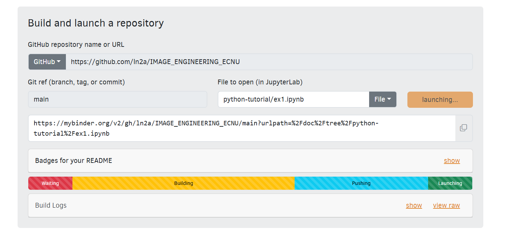

# 图像工程（2026）

华东师范大学 · 计算机科学与技术学院 · 图像工程课程在线教程

## 在线访问

- **Cloudflare Pages：** [https://image-engineering-ecnu.pages.dev/](https://image-engineering-ecnu.pages.dev/)
- 网站由 MkDocs 构建，使用 Material 主题，部署于 Cloudflare Pages。

## Python 演示代码

代码放置在 [python-tutorial/](python-tutorial/) 目录下，为 Jupyter Notebook（`.ipynb`）格式，可通过 Binder 在线运行。

**命名规则：** `ex{章}_{个}.ipynb`，例如：

| 文件名 | 对应章节 | 内容 |
|--------|----------|------|
| `ex1_1.ipynb` | 第一章 · 演示 1 | 图像形成与数字图像基础 |
| `ex2_1.ipynb` | 第二章 · 演示 1 | 图像增强与滤波 |

代码通过 [Binder](https://mybinder.org/) 发布为可交互网页：




## 项目结构

```
image_website/
├── book.yml               # MinerU 导出配置（PDF → Markdown）
├── mkdocs.yml             # MkDocs 站点配置
├── Makefile                # 常用命令
├── requirements.txt        # Python 依赖
├── docs/                   # 站点源文件
│   ├── index.md            # 首页
│   ├── chapters/           # 各章内容（由 MinerU 生成）
│   └── images/             # 插图资源
├── python-tutorial/        # Python 演示代码（Jupyter Notebook）
│   ├── ex1_1.ipynb
│   ├── ex2_1.ipynb
│   └── ex_img/             # 演示用图片
├── material/               # 附加素材
├── resources/              # MinerU 解析结果与 PDF 源文件
├── minerupress/            # MinerU PDF 处理工具
└── site/                   # 构建输出
```

## 技术栈
- **PDF 处理：**  [minerupress](https://github.com/aronnaxlin/minerupress) 
- **在线运行：** [Binder](https://mybinder.org/)（Jupyter Notebook 交互环境）
- **部署平台：** [Cloudflare Pages](https://pages.cloudflare.com/)
