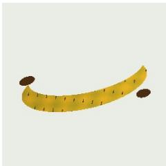
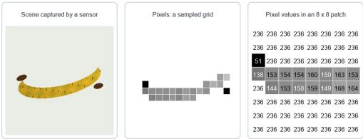
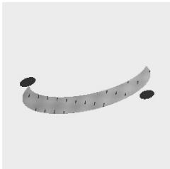
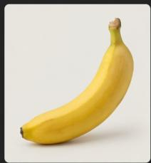
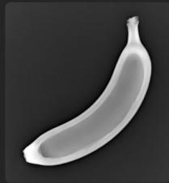
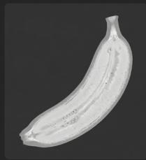
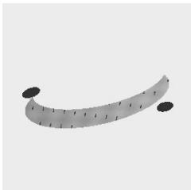
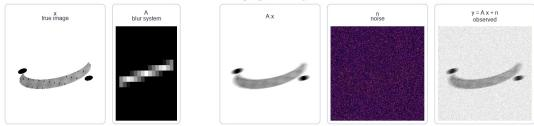
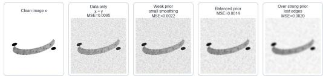
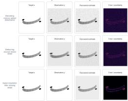

# 第一部分 图像形成与数字图像基础

### 图像从哪里来：图像形成与数字图像基础

## 核心问题

计算机看到的图像，不是 “照片”，而是由成像系统采集、采样、量化后得到的数字矩阵。

### 1. 成像过程

- 真实三维世界
- 光照与物体反射
- 相机镜头成像
- 传感器接收光信号
- 转换为数字图像

### 2. 数字图像表示

- 灰度图：二维矩阵
- 彩色图：三通道矩阵
- 图像本质：空间位置上的数值函数

$$
I (x, y) \in [ 0, 2 5 5 ]
$$

$$
I (x, y) = (R, G, B)
$$

### 需要理解的几个关键词

像素、分辨率、颜色空间、采样、量化、噪声、模糊、曝光、动态范围

### 引导性问题

为什么同一个场景，用不同手机拍出来的图像会不一样？

### 代码演示：数字图像矩阵





### Python 实现

\# 读取图像并把它理解为矩阵

```python
import cv2, numpy as np
img = cv2.imread("images/part1-original.jpg")
rgb = cv2.cvtColor(img, cv2.COLOR_BGR2RGB)
gray = cv2.cvtColor(rgb, cv2.COLOR_RGB2GRAY)
patch = gray[96:104, 44:52]
print("RGB shape:", rgb.shape)
print("Gray shape:", gray.shape)
print("8x8 patch:")
print(patch)
```

<a href="https://mybinder.org/v2/gh/ln2a/IMAGE_ENGINEERING_ECNU/main?urlpath=%2Fdoc%2Ftree%2Fpython-tutorial%2Fex1_ch01.ipynb" target="_blank" style="display: inline-block; background-color: #03a9f4; color: white; padding: 10px 24px; border-radius: 6px; text-decoration: none; font-size: 15px; margin-top: 4px; margin-bottom: 8px;">运行此代码 →</a>

### 代码演示：采样与量化




### Python 实现

\# 采样改变空间分辨率，量化改变灰度级数

```python
import cv2, numpy as np, matplotlib.pyplot as plt
gray = cv2.imread("images/part1-gray.jpg", 0)
low = cv2.resize(gray, (32, 32), interpolation=cv2.INTER_AREA)
low_show = cv2.resize(low, gray.shape[::-1], interpolation=cv2.INTER_NEAREST)
q4 = np.round(gray / 255 * 3) / 3
q4 = (q4 * 255).astype("uint8")
imgs = [gray, low_show, q4]
titles = ["Original", "Sampling 32x32", "Quantization 4 levels"]
fig, ax = plt.subplots(1, 3, figsize=(12, 4))
for a, i, t in zip(ax, imgs, titles):
    a.imshow(i, cmap="gray"); a.set_title(t); a.axis("off")
plt.tight_layout(); plt.show()
```

<a href="https://mybinder.org/v2/gh/ln2a/IMAGE_ENGINEERING_ECNU/main?urlpath=%2Fdoc%2Ftree%2Fpython-tutorial%2Fex2_ch01.ipynb" target="_blank" style="display: inline-block; background-color: #03a9f4; color: white; padding: 10px 24px; border-radius: 6px; text-decoration: none; font-size: 15px; margin-top: 4px; margin-bottom: 8px;">运行此代码 →</a>

## Banana Through Every Scan








## 树的 CT


## 同一个物体，为什么会有不同的图像？

### 观察现象

同一个香蕉，在普通照片、X 光、MRI、CT 中呈现出完全不同的样子。

### 普通照片

- 主要记录物体表面的颜色和亮度
- 依赖可见光反射
- 更接近人眼看到的结果

### MRI 图像

- 反映组织中氢原子信号差异
- 对软组织成像效果较好
- 医学诊断中非常重要

### X 光图像

- 反映射线穿透后的衰减差异
- 常用于观察内部结构
- 骨骼、金属等高密度区域更明显

### CT 图像

- 从多个角度采集 X 光投影
- 通过重建算法得到断层图像
- 可以观察物体或人体内部切片

### 关键理解

图像不是 “客观世界本身”，而是某种成像机制下得到的信息表达。

## 以 CT 为例：图像可以是 “计算” 出来的

### 直观理解

普通照片通常是一次成像，而 CT 图像不是简单 “拍” 出来的，而是通过多个角度的测量数据重建出来的。

多角度投影数据 → 重建算法 → 断层图像

### CT 采集什么？

- X 光从不同角度穿过物体
- 探测器记录射线衰减程度
- 得到一组投影数据

### CT 重建什么？

- 反推出物体内部结构
- 得到二维切片图像
- 多张切片可组成三维体数据

### 关键点

有些图像不是直接拍摄得到的，而是由观测数据经过数学模型和算法重建得到的。

### 代码演示：CT 投影与重建


### Python 实现

```python
# CT: 多角度投影数据 -> 重建算法 -> 断层图像
import cv2, numpy as np, matplotlib.pyplot as plt
from skimage.transform import radon, iradon
x = cv2.imread("images/part1-density.jpg", 0) / 255.0
theta = np.linspace(0, 180, 180, endpoint=False)
y = radon(x, theta=theta, circle=False)
recon = iradon(y, theta=theta, circle=False, filter_name="ramp")
fig, ax = plt.subplots(1, 3, figsize=(12, 4))
for a, i, t in , zip(ax, [x, y, recom], ["x", "projection y", "reconstruction {

    a.imshow(cmap="gray"); a.set_title(t); a.axis("off")
plt.tight_layout(); plt.show()
```

<a href="https://mybinder.org/v2/gh/ln2a/IMAGE_ENGINEERING_ECNU/main?urlpath=%2Fdoc%2Ftree%2Fpython-tutorial%2Fex3_ch01.ipynb" target="_blank" style="display: inline-block; background-color: #03a9f4; color: white; padding: 10px 24px; border-radius: 6px; text-decoration: none; font-size: 15px; margin-top: 4px; margin-bottom: 8px;">运行此代码 →</a>

## 从 “成像” 到 “模型”：图像工程中的基本抽象

### 为什么要建立数学模型？

真实成像过程往往很复杂。为了让计算机能够处理图像，我们需要把成像过程抽象成可以计算、分析和优化的数学模型。


### 未知对象

- $x$ : 真实图像或物体结构
- 可能是二维图像
- 也可能是三维体数据

### 观测结果

- $y$ ：设备采集到的数据
- 可能是照片
- 也可能是投影、回波或传感器信号

### 关键理解

图像工程不是只处理 “已经存在的图像”，也研究图像是怎样被测量、形成和恢复出来的。

## 一个统一的成像模型

### 常见抽象

很多成像过程都可以写成：

$$
y = A x + n
$$

- $x$ ：真实图像或物体结构；
A: 成像系统或测量过程；- $y$ ：设备实际采集到的数据；
- $n$ ：噪声、误差或干扰。

### 不同任务中的 $A$

- 普通拍照：相机成像过程；
- 图像模糊：模糊核或运动轨迹；
- CT 成像：多角度投影过程；
- 图像压缩：信息编码与丢失过程。

### 一句话

看似不同的图像问题，背后常常有相似的数学结构。

### 代码演示：统一模型 $y = Ax + n$





### Python 实现

```python
# 用运动模糊模拟 A，用随机流动模型 n
import cv2, numpy as np, matplotlib.pyplot as plt
x = cv2.imread("images/part1-gray.jpg", 0) / 255.0
k = np.zeros((17, 17)); k[8, :] = 1; k = k / k.sum()
Ax = cv2.filter2d(x.astype("float32"), -1, k)
n = np.random.normal(0, 0.05, x.shape)
y = np.clip(Ax + n, 0, 1)
imga = [x, k, Ax, y]
titles = ["x", "A": "cur kernel", "Ax", "y=Ax+n"]
fig, ax = plt.subplots(1, 4, figsize=(14, 4))
for a, i, t in zip(ax, imga, titles);
a.imshow(i, cmap='gray'); a.set_title(t); a.axis("off")
plt.tightLayout(); plt.show()
```

<a href="https://mybinder.org/v2/gh/ln2a/IMAGE_ENGINEERING_ECNU/main?urlpath=%2Fdoc%2Ftree%2Fpython-tutorial%2Fex4_ch01.ipynb" target="_blank" style="display: inline-block; background-color: #03a9f4; color: white; padding: 10px 24px; border-radius: 6px; text-decoration: none; font-size: 15px; margin-top: 4px; margin-bottom: 8px;">运行此代码 →</a>

## 正问题与逆问题

### 正问题

已知真实图像 $x$ 和成像系统 $A$ ，求观测数据 $y: x \longrightarrow y, \quad y = Ax + n$

### 逆问题

已知观测数据 y 和成像系统 A，反过来恢复真实图像 $x: y \longrightarrow x$

### 正问题

- 模拟成像过程
- 通常比较直接
例如：清晰图像变成模糊图像

### 逆问题

- 从观测结果反推原因
- 通常更加困难
例如：模糊图像恢复清晰图像

## 一个简单例子：图像去噪

### 问题

观测图像 y 是真实图像 x 加上噪声得到的： $y = x + n$

### 恢复模型

$$
\min _ {x} \underbrace {\| x - y \| ^ {2}} _ {不要偏离原图太多} + \lambda \underbrace {R (x)} _ {让图像更平滑或更有结构}
$$

### 只相信数据

- 直接取 $x = y$
- 噪声也被保留下来

### 正则过强

- 噪声减少
- 细节和边缘也可能被抹掉

## 一个简单例子：图像去模糊

### 问题

拍照时手抖、物体运动或镜头失焦，都可能导致图像模糊。

$$
y = k * x + n
$$

- $x$ ：清晰图像；
- $k$ ：模糊核；
- \*：卷积操作；
- $y$ ：观测到的模糊图像；
- $n$ ：噪声或误差。

### 恢复目标

$$
\min _ {x} \| k * x - y \| ^ {2} + \lambda R (x)
$$

### 为什么难？

模糊会损失边缘和纹理等高频细节，而噪声又会干扰恢复过程。

### 代码演示：图像去噪




### Python 实现

\# 去噪：既要贴近观测 y，又要让图像更平滑

import cv2, numpy as np, matplotlib.pyplot as plt

y = cv2.imread("images/part1-noisy.jpg", 0) / 255.0

weak = cv2.GaussianBlur(y, (0, 0), 0.7)

balanced = cv2.GaussianBlur(y, (0, 0), 1.4)

strong = cv2.GaussianBlur(y, (0, 0), 3.2)

imgs = [y, weak, balanced, strong]

titles = ["Data only", "Weak prior", "Balanced prior", "Strong prior"]

fig, ax = plt.subplots(1, 4, figsize=(14, 4))

for a, i, t in zip(ax, imgs, titles):

a.imshow(i, cmap="gray"); a.set\_title(t); a.axis("off")

plt.tight\_layout(); plt.show()

## 去噪与去模糊有什么不同？

### 图像去噪

$$
y = x + n
$$

- 主要问题是随机扰动
- 图像结构大体还在
- 目标是去除噪声、保留细节

### 图像去模糊

$$
y = k * x + n
$$

- 细节被扩散或混合
- 边缘变宽，纹理变弱
- 目标是恢复丢失的高频信息

### 关键区别

去噪更多是 “去掉多出来的干扰”，去模糊更多是 “找回被混合掉的细节”。

## 一个简单例子：图像超分辨率

### 问题

低分辨率图像缺少细节，希望恢复出更高分辨率的图像。

$$
y = D x + n
$$

- $x$ ：高分辨率图像；
- $D$ : 下采样过程；- $y$ ：低分辨率图像；
- $n$ ：噪声或误差。

### 恢复目标

$$
\min _ {x} \| D x - y \| ^ {2} + \lambda R (x)
$$

### 课堂提问

电影里 “把模糊监控无限放大后看清车牌” 的情节，为什么现实中并不总是可行？

## 图像恢复中的共同结构

### 看似不同的问题

去噪、去模糊、超分辨率、CT 重建，看起来任务不同。

去噪 : $y = x + n$

去模糊 : $y = k * x + n$

超分辨率： $y = Dx + n$

CT 重建 : $y = Ax + n$

### 共同形式

$$
\min _ {x} \| A x - y \| ^ {2} + \lambda R (x)
$$

### 课程观点

图像工程中很多问题不是孤立的，而是可以放在统一的建模框架下理解。

### 代码演示：三个逆问题对比




### Python 实现

### 逆问题：从观测 y 估计真实图像 x
# 去噪：y = x + n
# 去模糊：y = k \* x + n
# 超分辨率：y = D x + n
# 核心思想：
# min ||A x - y||^2 + lambda R (x)
print ("Denoising removes added noise.")
print ("Deblurring recovers mixed details.")
print ("Super-resolution infers missing details.")

## 图像先验：什么样的图像更合理？

### 先验的含义

先验就是我们对 “自然图像通常具有哪些规律” 的经验判断。

### 传统图像先验

- 图像通常局部平滑
- 边缘处允许明显变化
- 梯度往往具有稀疏性
- 相似纹理可能重复出现

### 领域图像先验

- 医学图像有解剖结构规律
- 遥感图像有地物分布规律
- 人脸图像有五官结构规律
- 工业图像有规则纹理和缺陷模式

### 一句话

没有先验，很多逆问题无法稳定求解；先验越合适，恢复结果越可靠。

## 传统方法：人工设计先验

### 基本思路

传统图像恢复方法通常把先验写成一个显式的正则项：

$$
\min _ {x} \| A x - y \| ^ {2} + \lambda R (x)
$$

### 常见正则项

\- 平滑正则

$$
R (x) = \| \nabla x \| ^ {2}
$$

\- 全变差正则

$$
R (x) = \| \nabla x \| _ {1}
$$

### 特点

- 模型清楚
- 可解释性较强
- 便于数学分析
- 但表达能力有限

## 深度学习方法：从数据中学习先验

### 基本思路

深度学习方法不一定显式写出 $R(x)$ ，而是从大量样本中学习图像规律。

$$
x \approx f _ {\theta} (y)
$$

- $y$ ：低质量图像，如带噪、模糊、低分辨率图像；
- $x$ ：目标图像，如清晰、干净、高分辨率图像；
- $f_{\theta}$ ：由神经网络表示的恢复模型；
- $\theta$ ：通过训练数据学习得到的参数。

### 理解方式

神经网络可以看作从数据中学习了一个复杂的图像先验或恢复规则。

## 传统方法与深度学习方法的对比

### 传统模型驱动方法

- 显式写出成像模型
- 显式设计正则项
- 可解释性较好
- 对数据依赖较少
- 复杂场景下能力有限

### 深度学习数据驱动方法

- 从数据中学习映射
- 表达能力强
- 效果常常更好
- 依赖数据和算力
- 泛化性和可解释性仍是挑战

### 发展趋势

现代图像工程越来越强调模型驱动与数据驱动的结合。

## 模型驱动与数据驱动的结合

### 一种现代思路

不是完全抛弃传统模型，而是把成像模型、优化算法和神经网络结合起来。

物理成像模型 + 优化思想 + 深度网络 $\Longrightarrow$ 现代图像恢复方法

- 用 $A$ 描述真实成像过程；
- 用数据保真项保证结果不偏离观测；
- 用神经网络学习复杂先验；
- 用迭代结构增强可解释性和稳定性。

### 课程主线

传统图像处理提供模型和思想，深度学习提供更强的表达能力。

## 从图像形成到图像处理

### 到目前为止，我们已经回答了第一个问题

### 图像从哪里来？

- 图像来自不同的成像机制；
- 数字图像来自采样和量化；
- 很多成像过程可以写成 $y = Ax + n$ ;
- 从观测恢复图像往往是逆问题；
- 逆问题需要结合数据保真和图像先验。

### 下一讲

现实中的图像经常存在噪声、模糊、低对比度、光照不均等问题。

如何让图像变得更清楚、更适合后续分析？

这就进入第二部分：图像增强与滤波。
