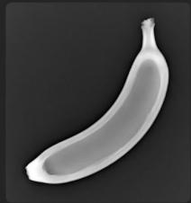
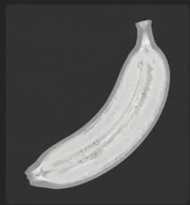

# 第一部分 图像形成与数字图像基础

## 图像从哪里来：图像形成与数字图像基础

核心问题

计算机看到的图像，不是 “照片”，而是由成像系统采集、采样、量化后得到的数字矩阵。

1. 成像过程

- 真实三维世界
- 光照与物体反射
- 相机镜头成像
- 传感器接收光信号
- 转换为数字图像

2. 数字图像表示

- 灰度图：二维矩阵
- 彩色图：三通道矩阵
- 图像本质：空间位置上的数值函数

$$
I (x, y) \in [ 0, 2 5 5 ]
$$

$$
I (x, y) = (R, G, B)
$$

需要理解的几个关键词

像素、分辨率、颜色空间、采样、量化、噪声、模糊、曝光、动态范围

引导性问题

为什么同一个场景，用不同手机拍出来的图像会不一样？

## Banana Through Every Scan







## 树的 CT


## 同一个物体，为什么会有不同的图像？

观察现象

同一个香蕉，在普通照片、X 光、MRI、CT 中呈现出完全不同的样子。

普通照片

- 主要记录物体表面的颜色和亮度
- 依赖可见光反射
- 更接近人眼看到的结果

MRI 图像

- 反映组织中氢原子信号差异
- 对软组织成像效果较好
- 医学诊断中非常重要

X 光图像

- 反映射线穿透后的衰减差异
- 常用于观察内部结构
- 骨骼、金属等高密度区域更明显

CT 图像

- 从多个角度采集 X 光投影
- 通过重建算法得到断层图像
- 可以观察物体或人体内部切片

关键理解

图像不是 “客观世界本身”，而是某种成像机制下得到的信息表达。

## 以 CT 为例：图像可以是 “计算” 出来的

直观理解

普通照片通常是一次成像，而 CT 图像不是简单 “拍” 出来的，而是通过多个角度的测量数据重建出来的。

多角度投影数据 → 重建算法 → 断层图像

CT 采集什么？

- X 光从不同角度穿过物体
- 探测器记录射线衰减程度
- 得到一组投影数据

CT 重建什么？

- 反推出物体内部结构
- 得到二维切片图像
- 多张切片可组成三维体数据

关键点

有些图像不是直接拍摄得到的，而是由观测数据经过数学模型和算法重建得到的。

## 从 “成像” 到 “模型”：图像工程中的基本抽象

为什么要建立数学模型？

真实成像过程往往很复杂。为了让计算机能够处理图像，我们需要把成像过程抽象成可以计算、分析和优化的数学模型。


未知对象

- $x$ : 真实图像或物体结构
- 可能是二维图像
- 也可能是三维体数据

观测结果

- $y$ ：设备采集到的数据
- 可能是照片
- 也可能是投影、回波或传感器信号

关键理解

图像工程不是只处理 “已经存在的图像”，也研究图像是怎样被测量、形成和恢复出来的。

## 一个统一的成像模型

常见抽象

很多成像过程都可以写成：

$$
y = A x + n
$$

- $x$ ：真实图像或物体结构；
A: 成像系统或测量过程；- $y$ ：设备实际采集到的数据；
- $n$ ：噪声、误差或干扰。

不同任务中的 $A$

- 普通拍照：相机成像过程；
- 图像模糊：模糊核或运动轨迹；
- CT 成像：多角度投影过程；
- 图像压缩：信息编码与丢失过程。

一句话

看似不同的图像问题，背后常常有相似的数学结构。

## 正问题与逆问题

正问题

已知真实图像 $x$ 和成像系统 $A$ ，求观测数据 $y: x \longrightarrow y, \quad y = Ax + n$

逆问题

已知观测数据 y 和成像系统 A，反过来恢复真实图像 $x: y \longrightarrow x$

正问题

- 模拟成像过程
- 通常比较直接
例如：清晰图像变成模糊图像

逆问题

- 从观测结果反推原因
- 通常更加困难
例如：模糊图像恢复清晰图像

## 一个简单例子：图像去噪

问题

观测图像 y 是真实图像 x 加上噪声得到的： $y = x + n$

恢复模型

$$
\min _ {x} \underbrace {\| x - y \| ^ {2}} _ {不要偏离原图太多} + \lambda \underbrace {R (x)} _ {让图像更平滑或更有结构}
$$

只相信数据

- 直接取 $x = y$
- 噪声也被保留下来

正则过强

- 噪声减少
- 细节和边缘也可能被抹掉

## 一个简单例子：图像去模糊

问题

拍照时手抖、物体运动或镜头失焦，都可能导致图像模糊。

$$
y = k * x + n
$$

- $x$ ：清晰图像；
- $k$ ：模糊核；
- \*：卷积操作；
- $y$ ：观测到的模糊图像；
- $n$ ：噪声或误差。

恢复目标

$$
\min _ {x} \| k * x - y \| ^ {2} + \lambda R (x)
$$

为什么难？

模糊会损失边缘和纹理等高频细节，而噪声又会干扰恢复过程。

## 去噪与去模糊有什么不同？

图像去噪

$$
y = x + n
$$

- 主要问题是随机扰动
- 图像结构大体还在
- 目标是去除噪声、保留细节

图像去模糊

$$
y = k * x + n
$$

- 细节被扩散或混合
- 边缘变宽，纹理变弱
- 目标是恢复丢失的高频信息

关键区别

去噪更多是 “去掉多出来的干扰”，去模糊更多是 “找回被混合掉的细节”。

## 一个简单例子：图像超分辨率

问题

低分辨率图像缺少细节，希望恢复出更高分辨率的图像。

$$
y = D x + n
$$

- $x$ ：高分辨率图像；
- $D$ : 下采样过程；- $y$ ：低分辨率图像；
- $n$ ：噪声或误差。

恢复目标

$$
\min _ {x} \| D x - y \| ^ {2} + \lambda R (x)
$$

课堂提问

电影里 “把模糊监控无限放大后看清车牌” 的情节，为什么现实中并不总是可行？

## 图像恢复中的共同结构

看似不同的问题

去噪、去模糊、超分辨率、CT 重建，看起来任务不同。

去噪 : $y = x + n$

去模糊 : $y = k * x + n$

超分辨率： $y = Dx + n$

CT 重建 : y = Ax + n

共同形式

$$
\min _ {x} \| A x - y \| ^ {2} + \lambda R (x)
$$

课程观点

图像工程中很多问题不是孤立的，而是可以放在统一的建模框架下理解。

## 图像先验：什么样的图像更合理？

先验的含义

先验就是我们对 “自然图像通常具有哪些规律” 的经验判断。

传统图像先验

- 图像通常局部平滑
- 边缘处允许明显变化
- 梯度往往具有稀疏性
- 相似纹理可能重复出现

领域图像先验

- 医学图像有解剖结构规律
- 遥感图像有地物分布规律
- 人脸图像有五官结构规律
- 工业图像有规则纹理和缺陷模式

一句话

没有先验，很多逆问题无法稳定求解；先验越合适，恢复结果越可靠。

## 传统方法：人工设计先验

基本思路

传统图像恢复方法通常把先验写成一个显式的正则项：

$$
\min _ {x} \| A x - y \| ^ {2} + \lambda R (x)
$$

常见正则项

\- 平滑正则

$$
R (x) = \| \nabla x \| ^ {2}
$$

\- 全变差正则

$$
R (x) = \| \nabla x \| _ {1}
$$

特点

- 模型清楚
- 可解释性较强
- 便于数学分析
- 但表达能力有限

## 深度学习方法：从数据中学习先验

基本思路

深度学习方法不一定显式写出 $R(x)$ ，而是从大量样本中学习图像规律。

$$
x \approx f _ {\theta} (y)
$$

- $y$ ：低质量图像，如带噪、模糊、低分辨率图像；
- $x$ ：目标图像，如清晰、干净、高分辨率图像；
- $f_{\theta}$ ：由神经网络表示的恢复模型；
- $\theta$ ：通过训练数据学习得到的参数。

理解方式

神经网络可以看作从数据中学习了一个复杂的图像先验或恢复规则。

## 传统方法与深度学习方法的对比

传统模型驱动方法

- 显式写出成像模型
- 显式设计正则项
- 可解释性较好
- 对数据依赖较少
- 复杂场景下能力有限

深度学习数据驱动方法

- 从数据中学习映射
- 表达能力强
- 效果常常更好
- 依赖数据和算力
- 泛化性和可解释性仍是挑战

发展趋势

现代图像工程越来越强调模型驱动与数据驱动的结合。

## 模型驱动与数据驱动的结合

一种现代思路

不是完全抛弃传统模型，而是把成像模型、优化算法和神经网络结合起来。

物理成像模型 + 优化思想 + 深度网络 $\Longrightarrow$ 现代图像恢复方法

- 用 $A$ 描述真实成像过程；
- 用数据保真项保证结果不偏离观测；
- 用神经网络学习复杂先验；
- 用迭代结构增强可解释性和稳定性。

课程主线

传统图像处理提供模型和思想，深度学习提供更强的表达能力。

## 从图像形成到图像处理

到目前为止，我们已经回答了第一个问题

图像从哪里来？

- 图像来自不同的成像机制；
- 数字图像来自采样和量化；
- 很多成像过程可以写成 $y = Ax + n$ ;
- 从观测恢复图像往往是逆问题；
- 逆问题需要结合数据保真和图像先验。

下一讲

现实中的图像经常存在噪声、模糊、低对比度、光照不均等问题。

如何让图像变得更清楚、更适合后续分析？

这就进入第二部分：图像增强与滤波。

---

## 演示代码 — BGR 与 RGB 色彩空间

```python
import cv2
import matplotlib.pyplot as plt
import numpy as np

# OpenCV 默认以 BGR 顺序读取图片
img_bgr = cv2.imread('../images/lena_color_512.png')

# 转换为 RGB 顺序以便用 matplotlib 正确显示
img_rgb = cv2.cvtColor(img_bgr, cv2.COLOR_BGR2RGB)

def plot_res(images, titles):
    n = len(images)
    fig, axes = plt.subplots(1, n, figsize=(16, 8))
    if n == 1:
        axes = [axes]
    for ax, img, title in zip(axes, images, titles):
        ax.imshow(img)
        ax.set_title(title, fontsize=12)
        ax.axis('off')
    plt.tight_layout()
    plt.show()

plot_res(
    [img_bgr, img_rgb],
    ["OpenCV BGR (色彩错误)", "转换为 RGB (色彩正确)"]
)
```

<a href="https://mybinder.org/v2/gh/ln2a/IMAGE_ENGINEERING_ECNU/main?urlpath=%2Fdoc%2Ftree%2Fpython-tutorial%2Fex1_1.ipynb" target="_blank" style="display: inline-block; background-color: #03a9f4; color: white; padding: 10px 24px; border-radius: 6px; text-decoration: none; font-size: 15px; margin-top: 8px;">运行此代码 →</a>
