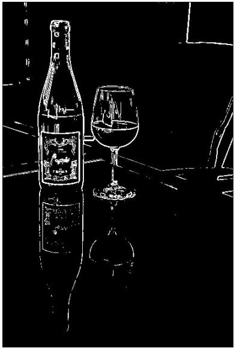
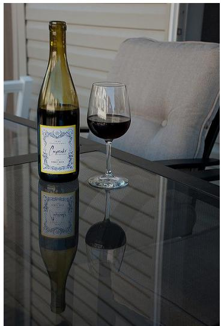

# 第三部分 锐化与边缘检测

## 第三部分：锐化与边缘检测

核心问题

平滑滤波可以减弱噪声，但也可能让边缘变得模糊。如果我们希望突出物体轮廓、纹理细节和结构变化，就需要进行锐化与边缘检测。

原始图像 → 锐化处理 → 边缘和细节更明显

锐化

- 增强图像细节
- 使边缘更加清楚
- 改善视觉清晰度

边缘检测

- 找出灰度变化明显的位置
- 提取目标轮廓
- 为分割、识别做准备

一句话

边缘通常对应图像中灰度变化剧烈的地方。

## 什么是边缘？

直观理解

在图像中，如果相邻区域的灰度或颜色发生明显变化，我们通常认为那里存在边缘。

- 物体与背景的交界处；
- 明暗变化明显的位置；
- 纹理方向发生变化的位置；
- 不同材料、不同结构的边界。

数学理解

边缘可以看作图像函数变化最快的位置。

边缘 $\Longleftrightarrow$ 灰度变化大

## 一阶导数：用梯度描述边缘

基本思想

如果把图像看作二维函数 $f(x, y)$ ，那么灰度变化可以用偏导数描述：

$$
f _ {x} = \frac {\partial f}{\partial x}, \quad f _ {y} = \frac {\partial f}{\partial y}
$$

梯度向量为:

$$
\nabla f = (f _ {x}, f _ {y})
$$

梯度幅值为:

$$
| \nabla f | = \sqrt {f _ {x} ^ {2} + f _ {y} ^ {2}}
$$

- 梯度越大，说明灰度变化越剧烈；
- 灰度变化剧烈的位置，往往就是边缘；
- 边缘检测可以理解为寻找梯度较大的位置。

## 离散图像中的梯度近似

问题

数字图像不是连续函数，而是像素矩阵。因此，导数需要用差分来近似。

水平方向差分

$$
f _ {x} (i, j) \approx f (i, j + 1) - f (i, j)
$$

竖直方向差分

$$
f _ {y} (i, j) \approx f (i + 1, j) - f (i, j)
$$

理解

- 如果相邻像素差别很小，说明局部比较平滑；
- 如果相邻像素差别很大，说明可能存在边缘；
- 差分越大，边缘响应越强。

## Sobel 算子：常用的边缘检测方法

基本思想

Sobel 算子用两个卷积模板分别估计水平方向和竖直方向的灰度变化。

$$
G _ {x} = \left[ \begin{array}{c c c} - 1 & 0 & 1 \\ - 2 & 0 & 2 \\ - 1 & 0 & 1 \end{array} \right], \qquad G _ {y} = \left[ \begin{array}{c c c} - 1 & - 2 & - 1 \\ 0 & 0 & 0 \\ 1 & 2 & 1 \end{array} \right]
$$

$$
G = \sqrt {G _ {x} ^ {2} + G _ {y} ^ {2}}
$$

特点

- 能突出边缘位置；
- 对噪声比简单差分更稳健；
- 是最经典的边缘检测方法之一。

## 边缘检测例子

## 锐化：让细节更突出

基本思想

锐化的目标是增强图像中的高频成分，例如边缘、纹理和细节。

锐化图像 = 原图像 + 细节增强项

一种常见形式是：

$$
g = f + \alpha (f - f _ {\text { smooth }})
$$

其中：

- $f$ : 原始图像；- $f_{\mathrm{smooth}}$ ：平滑后的图像；
- $f - f_{\mathrm{smooth}}$ ：图像中的细节部分；
- $\alpha$ ：锐化强度。

直观理解

先找出图像中 “被平滑掉的细节”，再把这些细节加回去。

## 拉普拉斯算子：二阶导数锐化

基本思想

拉普拉斯算子利用二阶导数检测灰度变化，常用于图像锐化。

$$
\Delta f = \frac {\partial^ {2} f}{\partial x ^ {2}} + \frac {\partial^ {2} f}{\partial y ^ {2}}
$$

常见离散模板：

$$
\left[ \begin{array}{c c c} {0} & {- 1} & {0} \\ {- 1} & {4} & {- 1} \\ {0} & {- 1} & {0} \end{array} \right] \quad \text {或} \quad \left[ \begin{array}{c c c} {- 1} & {- 1} & {- 1} \\ {- 1} & {8} & {- 1} \\ {- 1} & {- 1} & {- 1} \end{array} \right]
$$

锐化形式

$$
g = f + \lambda \Delta f
$$

注意

锐化可以增强边缘，但也可能同时放大噪声。

## 锐化例子

## 锐化与平滑的关系

看似相反，其实互补

平滑滤波

- 减弱噪声
- 抑制高频成分
- 图像更柔和
- 可能模糊边缘

锐化处理

- 增强细节
- 突出高频成分
- 边缘更清楚
- 可能放大噪声

工程经验

实际处理中，常常需要先适当去噪，再进行边缘检测或锐化。

去噪 → 锐化 → 边缘检测

## 边缘检测有什么用？

边缘是图像理解的重要线索

- 在医学图像中，帮助观察器官、病灶和组织边界；
- 在遥感图像中，帮助提取道路、河流、建筑轮廓；
- 在工业检测中，帮助发现裂纹、划痕和缺陷；
- 在自动驾驶中，帮助识别车道线、车辆和行人轮廓；
- 在文档图像中，帮助提取文字边界和版面结构。

一句话

边缘检测不是最终目的，而是许多图像分析任务的基础步骤。

## 第三部分阶段小结

① 边缘通常对应图像中灰度变化剧烈的位置。
② 梯度可以描述图像的一阶变化。
③ 梯度幅值越大，边缘响应通常越强。
4 数字图像中的导数通常用差分近似。
⑤ Sobel 算子是经典的一阶边缘检测方法。
⑥ 锐化可以增强图像细节，但也可能放大噪声。
7 平滑与锐化并不是完全对立，而是需要配合使用。

下一步

有了边缘之后，我们还希望进一步把图像中的目标区域分离出来。这就进入下一部分：图像分割。
