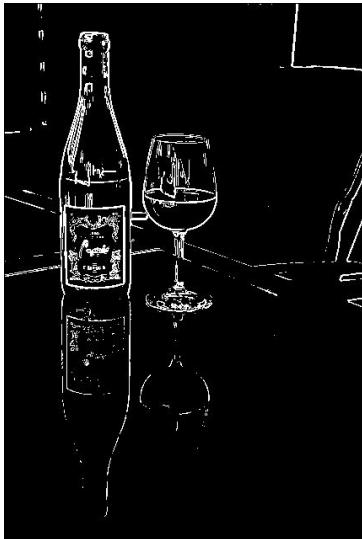
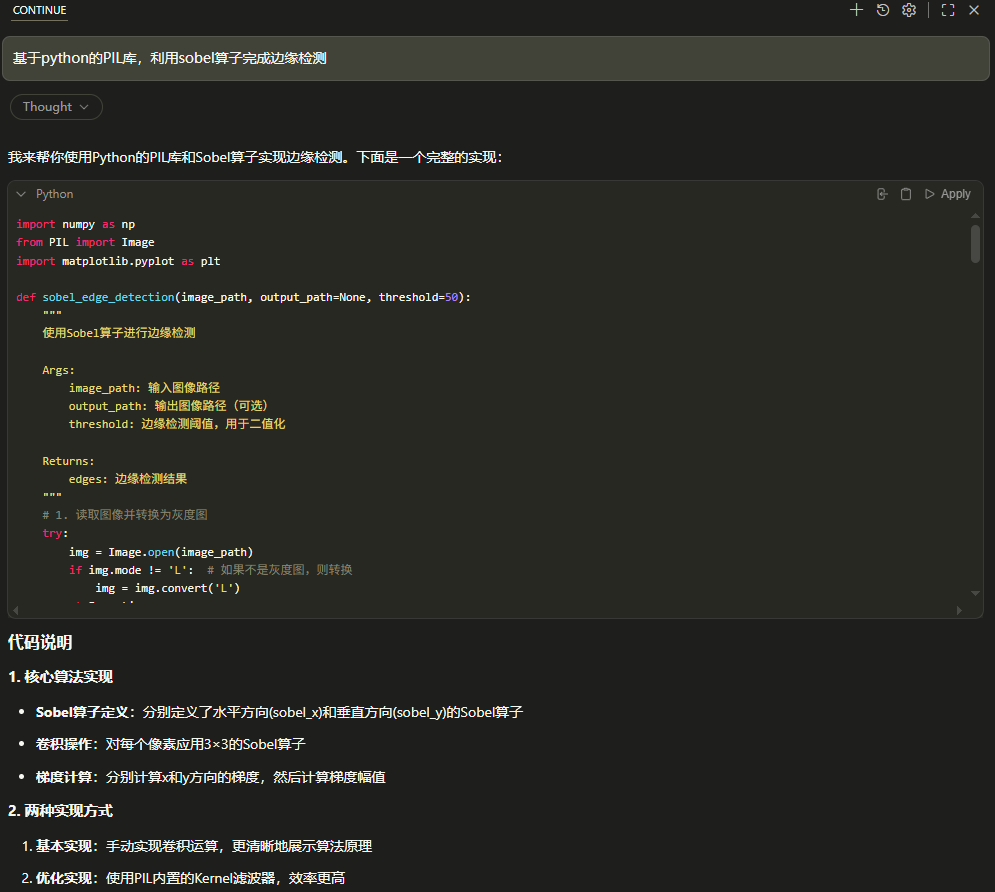

# 第三部分 锐化与边缘检测

## 第三部分：锐化与边缘检测

## 核心问题

平滑滤波可以减弱噪声，但也可能让边缘变得模糊。如果我们希望突出物体轮廓、纹理细节和结构变化，就需要进行锐化与边缘检测。

原始图像 → 锐化处理 → 边缘和细节更明显

## 锐化

- 增强图像细节
- 使边缘更加清楚
- 改善视觉清晰度

## 边缘检测

- 找出灰度变化明显的位置
- 提取目标轮廓
- 为分割、识别做准备

## 一句话

边缘通常对应图像中灰度变化剧烈的地方。

## 什么是边缘？

## 直观理解

在图像中，如果相邻区域的灰度或颜色发生明显变化，我们通常认为那里存在边缘。

- 物体与背景的交界处；
- 明暗变化明显的位置；
- 纹理方向发生变化的位置；
- 不同材料、不同结构的边界。

## 数学理解

边缘可以看作图像函数变化最快的位置。

边缘 $\Longleftrightarrow$ 灰度变化大

## 一阶导数：用梯度描述边缘

## 基本思想

如果把图像看作二维函数 $f(x, y)$ ，那么灰度变化可以用偏导数描述：

$$
f _ {x} = \frac {\partial f}{\partial x}, \quad f _ {y} = \frac {\partial f}{\partial y}
$$

梯度向量为:

$$
\nabla f = (f _ {x}, f _ {y})
$$

梯度幅值为:

$$
| \nabla f | = \sqrt {f _ {x} ^ {2} + f _ {y} ^ {2}}
$$

- 梯度越大，说明灰度变化越剧烈；
- 灰度变化剧烈的位置，往往就是边缘；
- 边缘检测可以理解为寻找梯度较大的位置。

## 离散图像中的梯度近似

## 问题

数字图像不是连续函数，而是像素矩阵。因此，导数需要用差分来近似。

## 水平方向差分

$$
f _ {x} (i, j) \approx f (i, j + 1) - f (i, j)
$$

## 竖直方向差分

$$
f _ {y} (i, j) \approx f (i + 1, j) - f (i, j)
$$

## 理解

- 如果相邻像素差别很小，说明局部比较平滑；
- 如果相邻像素差别很大，说明可能存在边缘；
- 差分越大，边缘响应越强。

## Sobel 算子：常用的边缘检测方法

## 基本思想

Sobel 算子用两个卷积模板分别估计水平方向和竖直方向的灰度变化。

$$
G _ {x} = \left[ \begin{array}{c c c} - 1 & 0 & 1 \\ - 2 & 0 & 2 \\ - 1 & 0 & 1 \end{array} \right], \qquad G _ {y} = \left[ \begin{array}{c c c} - 1 & - 2 & - 1 \\ 0 & 0 & 0 \\ 1 & 2 & 1 \end{array} \right]
$$

$$
G = \sqrt {G _ {x} ^ {2} + G _ {y} ^ {2}}
$$

## 特点

- 能突出边缘位置；
- 对噪声比简单差分更稳健；
- 是最经典的边缘检测方法之一。

## 代码演示：锐化




**Python 实现：**

```python
import numpy as np
from PIL import Image
import matplotlib.pyplot as plt

def sobel_edge_detection(image_path, threshold=50):
    """
    Edge detection using Sobel operator
    
    Args:
        image_path: Input image path
        threshold: Edge detection threshold for binarization
    
    Returns:
        edges: Edge detection result
    """
    # 1. Read image and convert to grayscale
    try:
        img = Image.open(image_path)
        if img.mode != 'L':  # If not grayscale, convert
            img = img.convert('L')
    except Exception as e:
        print(f"Cannot open image file: {e}")
        return None
    
    # 2. Convert image to numpy array
    img_array = np.array(img, dtype=np.float64)
    height, width = img_array.shape
    
    # 3. Define Sobel operators
    # Horizontal Sobel operator (detects vertical edges)
    sobel_x = np.array([
        [-1, 0, 1],
        [-2, 0, 2],
        [-1, 0, 1]
    ])
    
    # Vertical Sobel operator (detects horizontal edges)
    sobel_y = np.array([
        [-1, -2, -1],
        [0, 0, 0],
        [1, 2, 1]
    ])
    
    # 4. Create output images
    edge_x = np.zeros_like(img_array)
    edge_y = np.zeros_like(img_array)
    edges = np.zeros_like(img_array)
    
    # 5. Apply Sobel operators for convolution
    # Start from 1 to height-1 and width-1 to avoid boundary issues
    for i in range(1, height - 1):
        for j in range(1, width - 1):
            # Extract 3x3 region
            region = img_array[i-1:i+2, j-1:j+2]
            
            # Calculate horizontal gradient (Sobel_x)
            edge_x[i, j] = np.sum(region * sobel_x)
            
            # Calculate vertical gradient (Sobel_y)
            edge_y[i, j] = np.sum(region * sobel_y)
            
            # Calculate gradient magnitude
            edges[i, j] = np.sqrt(edge_x[i, j]**2 + edge_y[i, j]**2)
    
    # 6. Normalize to 0-255 range
    edges = (edges / np.max(edges) * 255).astype(np.uint8)
    
    # 7. Apply threshold for binarization (optional)
    if threshold > 0:
        edges_binary = edges.copy()
        edges_binary[edges_binary < threshold] = 0
        edges_binary[edges_binary >= threshold] = 255
        edges = edges_binary
    
    # 8. Display results
    plt.figure(figsize=(15, 5))
    
    plt.subplot(1, 3, 1)
    plt.imshow(img_array, cmap='gray')
    plt.title('Original Image')
    plt.axis('off')
    
    plt.subplot(1, 3, 2)
    plt.imshow(edges, cmap='gray')
    plt.title('Sobel Edge Detection')
    plt.axis('off')
    
    # Calculate gradient direction (optional visualization)
    gradient_direction = np.arctan2(edge_y, edge_x)
    gradient_direction = (gradient_direction + np.pi) / (2 * np.pi) * 255
    gradient_direction = gradient_direction.astype(np.uint8)
    
    plt.subplot(1, 3, 3)
    plt.imshow(gradient_direction, cmap='hsv')
    plt.title('Gradient Direction')
    plt.axis('off')
    
    plt.tight_layout()
    plt.show()
    
    return edges

# Example usage
if __name__ == "__main__":
    # Check if test image exists
    import os
    if not os.path.exists("test_image.png"):
        print("Please place an image named 'test_image.png' in the current directory")
        print("Or modify the image path in the code")
    else:
        # Method 1: Basic Sobel implementation
        result1 = sobel_edge_detection(
            image_path="test_image.png",
            threshold=50
        )
```

<a href="https://mybinder.org/v2/gh/ln2a/IMAGE_ENGINEERING_ECNU/main?urlpath=%2Fdoc%2Ftree%2Fpython-tutorial%2Fedge_detection.ipynb" target="_blank" style="display: inline-block; background-color: #03a9f4; color: white; padding: 10px 24px; border-radius: 6px; text-decoration: none; font-size: 15px; margin-top: 4px; margin-bottom: 8px;">运行此代码 →</a>

## 锐化：让细节更突出

## 基本思想

锐化的目标是增强图像中的高频成分，例如边缘、纹理和细节。

锐化图像 = 原图像 + 细节增强项

一种常见形式是：

$$
g = f + \alpha (f - f _ {\text { smooth }})
$$

其中：

- $f$ : 原始图像；- $f_{\mathrm{smooth}}$ ：平滑后的图像；
- $f - f_{\mathrm{smooth}}$ ：图像中的细节部分；
- $\alpha$ ：锐化强度。

## 直观理解

先找出图像中 “被平滑掉的细节”，再把这些细节加回去。

## 拉普拉斯算子：二阶导数锐化

## 基本思想

拉普拉斯算子利用二阶导数检测灰度变化，常用于图像锐化。

$$
\Delta f = \frac {\partial^ {2} f}{\partial x ^ {2}} + \frac {\partial^ {2} f}{\partial y ^ {2}}
$$

常见离散模板：

$$
\left[ \begin{array}{c c c} {0} & {- 1} & {0} \\ {- 1} & {4} & {- 1} \\ {0} & {- 1} & {0} \end{array} \right] \quad \text {或} \quad \left[ \begin{array}{c c c} {- 1} & {- 1} & {- 1} \\ {- 1} & {8} & {- 1} \\ {- 1} & {- 1} & {- 1} \end{array} \right]
$$

锐化形式

$$
g = f + \lambda \Delta f
$$

注意

锐化可以增强边缘，但也可能同时放大噪声。

## 代码演示：锐化


$$
\left[ \begin{array}{c c c} 0 & - 1 & 0 \\ - 1 & 4 & - 1 \\ 0 & - 1 & 0 \end{array} \right]
$$


$$
\left[ \begin{array}{c c c} - 1 & - 1 & - 1 \\ - 1 & 8 & - 1 \\ - 1 & - 1 & - 1 \end{array} \right]
$$

**Python 实现：**

```python
import numpy as np
from PIL import Image
import matplotlib.pyplot as plt

def image_sharpening(image_path, kernel_type="laplacian", alpha=0.5):
    """
    Image sharpening using different kernels with original image overlay
    
    Args:
        image_path: Input image path
        kernel_type: Kernel type ("laplacian", "edge_enhance")
        alpha: Sharpening strength coefficient
    
    Returns:
        sharpened: Sharpened image
    """
    # Read image and convert to grayscale
    try:
        img = Image.open(image_path)
        if img.mode != 'L':
            img = img.convert('L')
    except Exception as e:
        print(f"Cannot open image file: {e}")
        return None
    
    # Convert image to numpy array
    img_array = np.array(img, dtype=np.float64)
    height, width = img_array.shape
    
    # Define sharpening kernels
    kernels = {
        "laplacian": np.array([
            [0, -1, 0],
            [-1, 4, -1],
            [0, -1, 0]
        ]),
        
        "edge_enhance": np.array([
            [-1, -1, -1],
            [-1,  8, -1],
            [-1, -1, -1]
        ])
    }
    
    if kernel_type not in kernels:
        print(f"Unsupported kernel type: {kernel_type}")
        return None
    
    kernel = kernels[kernel_type]
    
    # Create output image for edge detection
    edge_result = np.zeros_like(img_array)
    
    # Apply kernel convolution to get edge information
    for i in range(1, height - 1):
        for j in range(1, width - 1):
            region = img_array[i-1:i+2, j-1:j+2]
            edge_result[i, j] = np.sum(region * kernel)
    
    # Overlay with original image using alpha strength
    # sharpened = original + alpha * edge_information
    sharpened = img_array + alpha * edge_result
    
    # Normalize to 0-255 range
    sharpened = np.clip(sharpened, 0, 255).astype(np.uint8)
    
    return sharpened

def display_sharpening_results(image_path, alpha=0.5):
    """
    Display original image and results from two sharpening kernels with overlay
    """
    # Read original image
    try:
        img = Image.open(image_path)
        if img.mode != 'L':
            img = img.convert('L')
    except Exception as e:
        print(f"Cannot open image file: {e}")
        return
    
    img_array = np.array(img)
    
    # Apply two sharpening kernels with overlay
    result_laplacian = image_sharpening(image_path, "laplacian", alpha)
    result_edge_enhance = image_sharpening(image_path, "edge_enhance", alpha)
    
    if result_laplacian is None or result_edge_enhance is None:
        return
    
    # Display three images
    plt.figure(figsize=(15, 5))
    
    # Original image
    plt.subplot(1, 3, 1)
    plt.imshow(img_array, cmap='gray')
    plt.title('Original Image')
    plt.axis('off')
    
    # Laplacian result with overlay
    plt.subplot(1, 3, 2)
    plt.imshow(result_laplacian, cmap='gray')
    plt.title(f'Laplacian')
    plt.axis('off')
    
    # Edge enhancement result with overlay
    plt.subplot(1, 3, 3)
    plt.imshow(result_edge_enhance, cmap='gray')
    plt.title(f'Edge Enhancement')
    plt.axis('off')
    
    plt.tight_layout()
    plt.show()
    
    return result_laplacian, result_edge_enhance

# Example usage
if __name__ == "__main__":
    import os
    test_image = "test_image.png"
    
    if not os.path.exists(test_image):
        print("Please place an image named 'test_image.png' in the current directory")
        print("Or modify the image path in the code")
        
        # Create a test image if none exists
        print("\nCreating test image...")
        test_img = np.zeros((200, 200), dtype=np.uint8)
        test_img[50:150, 50:150] = 128
        test_img[70:130, 70:130] = 200
        test_img[80:120, 80:120] = 50
        noise = np.random.randint(0, 30, (200, 200))
        test_img = np.clip(test_img + noise, 0, 255).astype(np.uint8)
        Image.fromarray(test_img).save(test_image)
        print(f"Test image created: {test_image}")
    
    # Display results with alpha=0.5
    display_sharpening_results(test_image, alpha=0.5)
```

<a href="https://mybinder.org/v2/gh/ln2a/IMAGE_ENGINEERING_ECNU/main?urlpath=%2Fdoc%2Ftree%2Fpython-tutorial%2Fimage_sharpen.ipynb" target="_blank" style="display: inline-block; background-color: #03a9f4; color: white; padding: 10px 24px; border-radius: 6px; text-decoration: none; font-size: 15px; margin-top: 4px; margin-bottom: 8px;">运行此代码 →</a>

## 锐化与平滑的关系

## 看似相反，其实互补

## 平滑滤波

- 减弱噪声
- 抑制高频成分
- 图像更柔和
- 可能模糊边缘

## 锐化处理

- 增强细节
- 突出高频成分
- 边缘更清楚
- 可能放大噪声

## 工程经验

实际处理中，常常需要先适当去噪，再进行边缘检测或锐化。

去噪 → 锐化 → 边缘检测

## 边缘检测有什么用？

## 边缘是图像理解的重要线索

- 在医学图像中，帮助观察器官、病灶和组织边界；
- 在遥感图像中，帮助提取道路、河流、建筑轮廓；
- 在工业检测中，帮助发现裂纹、划痕和缺陷；
- 在自动驾驶中，帮助识别车道线、车辆和行人轮廓；
- 在文档图像中，帮助提取文字边界和版面结构。

## 一句话

边缘检测不是最终目的，而是许多图像分析任务的基础步骤。

# Vibe Coding

**工具组合：** VS Code + Continue + Ollama（本地模型）/ API（如 DeepSeek 等）



## 第三部分阶段小结

① 边缘通常对应图像中灰度变化剧烈的位置。
② 梯度可以描述图像的一阶变化。
③ 梯度幅值越大，边缘响应通常越强。
4 数字图像中的导数通常用差分近似。
⑤ Sobel 算子是经典的一阶边缘检测方法。
⑥ 锐化可以增强图像细节，但也可能放大噪声。
7 平滑与锐化并不是完全对立，而是需要配合使用。

## 下一步

有了边缘之后，我们还希望进一步把图像中的目标区域分离出来。这就进入下一部分：图像分割。
