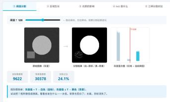

# 第四部分 图像分割

## 第四部分：图像分割

## 核心问题

有了边缘之后，我们常常还希望进一步回答：

图像中哪些像素属于同一个目标？

图像分割的目标，是把图像划分成若干有意义的区域。

原始图像 → 区域划分 → 目标提取

## 典型任务

- 从医学图像中分割器官或病灶；
- 从遥感图像中分割道路、建筑、水体；
- 从自然图像中分割人物、车辆、动物；
- 从工业图像中分割缺陷区域。

## 什么是图像分割？

## 基本定义

图像分割是将图像中的像素按照某种相似性或目标语义划分为不同区域的过程。

设图像区域为 $\Omega$ ，分割结果可以表示为：

$$
\Omega = \Omega_ {1} \cup \Omega_ {2} \cup \dots \cup \Omega_ {K}
$$

其中：

- $\Omega_{k}$ : 第 $k$ 个区域；- 同一区域内部像素具有相似性质；
- 不同区域之间具有明显差异。

## 关键问题

## 分割依据：像素为什么属于同一区域？

## 常见依据

- 灰度相似：亮度接近；
- 颜色相似：RGB 或 HSV 值接近；
- 纹理相似：局部结构或重复模式相似；
- 空间相邻：位置上连通；
- 语义一致：都属于同一类目标。

## 例子

- 蓝色区域可能对应天空；
- 灰色细长区域可能对应道路；
- 医学图像中亮度异常区域可能对应病灶。

## 注意

## 阈值分割：最简单的分割方法

## 基本思想

如果目标和背景在灰度上差异明显，可以用一个阈值 T 将它们分开。

$$
g (x, y) = \left\{ \begin{array}{l l} 1, & f (x, y) \geq T, \\ 0, & f (x, y) <   T. \end{array} \right.
$$

## 理解

- 灰度大于阈值：判为目标；
- 灰度小于阈值：判为背景；
- 结果通常是一幅二值图像。

## 适用场景

目标与背景对比明显、光照较均匀的图像。

## 阈值怎么选？

## 手动阈值

根据经验或观察直方图选择一个阈值。

$$
T = 1 2 8
$$

## 自动阈值

让算法根据图像灰度分布自动寻找较合适的阈值。直方图视角

如果目标和背景灰度分布明显分成两堆，阈值可以放在两堆之间。

背景峰 | 目标峰

## 课堂提问

如果一张图像左边很暗、右边很亮，还能用同一个全局阈值吗？

## 区域生长：从一个点扩展成一个区域

## 基本思想

先选择一个种子点，然后把周围与它相似的像素逐步加入同一区域。

种子点 → 检查邻域 → 加入相似像素 → 形成区域

## 判断依据

- 灰度差是否小于阈值；
- 颜色是否接近；
- 是否与当前区域连通。

## 特点

结果直观，但对种子点选择和相似性标准比较敏感。

## 边缘方法与区域方法的区别

## 边缘方法

- 关注灰度突变；
- 先找边界；
- 适合轮廓清楚的目标；
- 边缘断裂时效果会受影响。

## 区域方法

- 关注区域内部一致性；
- 先找相似像素集合；
- 适合灰度或颜色较均匀的目标；
- 对光照变化比较敏感。

## 理解

边缘方法问的是 “边界在哪里”，区域方法问的是 “哪些像素属于一起”。

## 传统分割方法的局限

## 为什么分割不容易？

真实图像往往比理想情况复杂得多：

- 光照不均：同一物体不同位置亮度不同；
- 背景复杂：目标和背景颜色接近；
- 边界模糊：物体轮廓不一定清楚；
- 噪声干扰：局部像素可能出现异常；
- 语义复杂：同一类目标外观差异很大。

## 关键理解

传统方法主要依赖灰度、颜色、边缘等低层特征，但很多时候，分割还需要理解图像中的 “内容”。

## 从传统分割到语义分割

## 传统分割

把图像分成若干区域，但不一定知道每个区域是什么。

图像 $\longrightarrow$ 区域 1、区域 2、区域 3

## 语义分割

不仅要分出区域，还要判断每个像素属于哪一类。

图像 $\longrightarrow$ 道路、天空、行人、车辆、建筑

## 一句话

传统分割更关注 “哪里不同”，语义分割更关注 “这是什么”。

## 语义分割：给每个像素分类

## 基本思想

语义分割可以理解为像素级分类任务。

$$
f (x, y) \longrightarrow c (x, y)
$$

其中：

- $f(x, y)$ : 图像中位置 $(x, y)$ 的像素信息；- $c(x, y)$ : 该像素对应的类别标签；- 每个像素都要被赋予一个语义类别。

## 例子

- 天空像素标为 sky;
- 道路像素标为 road;
- 行人像素标为 person;
- 车辆像素标为 car。

## 深度学习如何做分割？

## 基本思路

用神经网络从图像中学习特征，并输出每个像素的类别。

输入图像 $\xrightarrow{CNN / Transformer}$ 像素级类别图

## 网络需要学习什么？

- 局部纹理：边缘、角点、颜色变化；
- 中层结构：轮廓、部件、局部形状；
- 高层语义：人、车、道路、器官等目标类别；
- 空间关系：哪些区域可能属于同一个对象。

## 理解

深度学习方法不只是看单个像素，而是结合上下文判断像素类别。

## 语义分割与实例分割

## 语义分割

只判断每个像素属于哪一类。

所有人 → person

## 实例分割

不仅判断类别，还要区分不同个体。

人 1, 人 2, 人 3

- 语义分割：关心 “是什么”；
- 实例分割：还关心 “是哪一个”；
- 医学、自动驾驶、机器人感知中都很重要。

## 分割结果如何评价？

## 问题

算法分割出来的区域，和人工标注的真实区域有多接近？

常用指标：IoU

$$
\mathrm{IoU} = \frac {\text {预测区域} \cap \text {真实区域}}{\text {预测区域} \cup \text {真实区域}}
$$

## 理解

- 交集越大，说明分割越准确；
- 并集越大，说明总体覆盖范围越广；
- IoU 越接近 1，分割结果越好。

## 图像分割的例子

## 图像分割的应用

## 分割是图像理解的重要基础

- 医学诊断：分割肿瘤、血管、器官；
- 自动驾驶：分割道路、车道线、车辆、行人；
- 遥感分析：分割建筑、水体、农田、森林；
- 工业检测：分割裂纹、污点、缺陷区域；
- 智能修图：人像抠图、背景替换、主体增强。

## 一句话

分割把图像从 “像素矩阵” 变成了 “有意义的区域”。

## 第四部分阶段小结

① 图像分割的目标是把图像划分成有意义的区域。
② 阈值分割适合目标与背景差异明显的场景。
③ 区域生长从种子点出发，逐步合并相似像素。
4 边缘方法关注 “边界在哪里”。
⑤ 区域方法关注 “哪些像素属于一起”。
⑥ 语义分割进一步要求判断每个像素的类别。
⑦ 深度学习方法可以结合局部特征与上下文语义。

## 下一步

分割可以得到目标区域，但我们还希望进一步描述图像内容。接下来：图像特征与目标识别。
