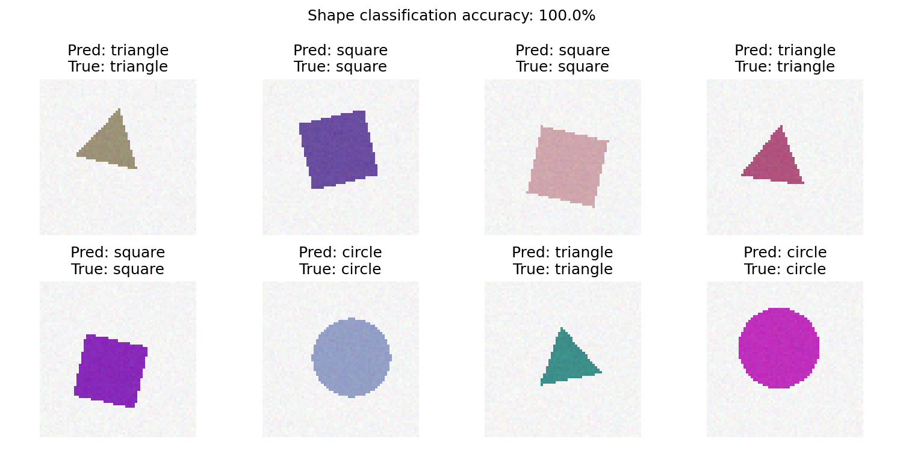
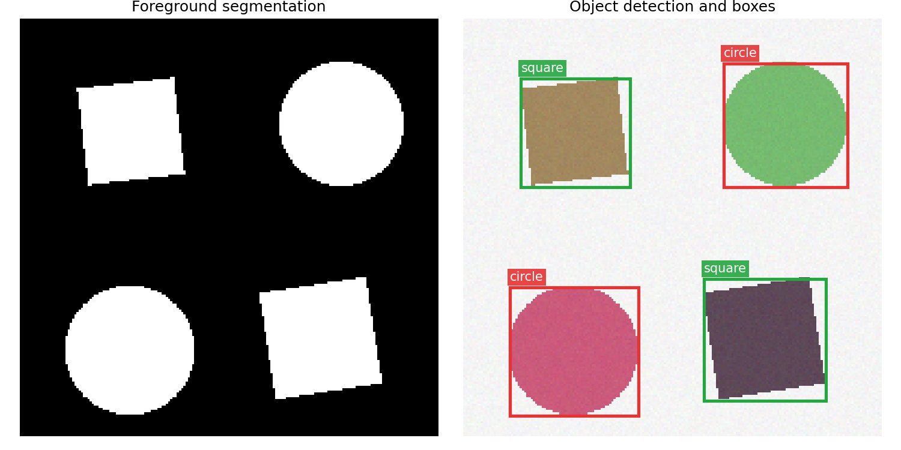

# 第五部分 图像特征与目标识别

## 核心问题

经过增强、边缘检测和分割之后，我们希望进一步回答三个问题：

- 图像中的目标有什么特点？
- 整张图像属于哪一类？
- 图像中有哪些目标，它们分别在哪里？

本章不只介绍概念，还提供两个可以直接运行的完整实验。数据由程序自动生成，
不需要联网下载；每个实验都有输入图像、中间结果、评价指标和最终可视化。

| 实验 | 数据 | 方法 | 可视化结果 |
| --- | --- | --- | --- |
| 特征与分类 | 随机圆形、正方形、三角形 | 形状特征 + 最近质心分类器 | 特征、混淆矩阵、逐图预测 |
| 目标检测 | 含多个随机目标的场景 | 前景分割 + 连通域 + 形状分类 | 分割掩膜、类别、边界框、IoU |

!!! tip "为什么使用合成数据？"

    合成数据不受下载地址、网络速度和授权限制，还能自动得到精确的类别与真实框，
    特别适合课堂上观察一条完整、可复现的识别流程。

## 1. 图像特征

图像特征是对图像中有用信息的数值化描述。它应尽量保留类别相关信息，同时减少
位置、尺度、颜色和轻微噪声等无关变化的影响。

### 1.1 为什么不直接比较像素？

同一个目标只要平移几个像素，矩阵中大量位置就会改变；光照、缩放和背景变化也会
显著影响像素值。因此，识别系统通常先把图像转换为更稳定的特征向量：

$$
\text{图像 } I \longrightarrow
\boldsymbol{x}=[x_1,x_2,\ldots,x_d]
$$

### 1.2 颜色特征

颜色直方图统计各颜色区间内的像素数量：

$$
h(k)=\#\{(x,y)\mid I(x,y)\text{ 落在第 }k\text{ 个颜色区间}\}
$$

它对目标位置变化不敏感，适合颜色差异明显的任务，但不能表达目标的空间结构。

### 1.3 纹理与形状特征

纹理描述局部像素的重复、粗糙程度和方向性；形状描述目标区域的几何外观。
本章实验使用四个容易理解的形状特征：

- **面积比**：目标面积占整幅图像的比例；
- **圆形度**：$C=4\pi A/P^2$，越接近圆形通常越大；
- **填充率**：目标面积与其外接矩形面积之比；
- **径向变化**：边界到中心距离的相对波动。

这些特征可以区分圆形、正方形和三角形，同时比直接比较像素更能容忍位置与尺度变化。

### 1.4 可运行实验：特征可视化

实验首先显示原图、提取的边界和 RGB 颜色直方图，再打印四维形状特征。

```python
image, mask = render_shape(kind=2)
edge = binary_perimeter(mask)
feature = extract_features(image)

plt.imshow(image)
plt.scatter(*np.where(edge)[::-1], s=5, c="yellow")
plt.show()
print(feature)
```

完整代码、数据生成函数和可视化均包含在实验 1 中。

<a href="https://mybinder.org/v2/gh/ln2a/IMAGE_ENGINEERING_ECNU/main?urlpath=%2Fdoc%2Ftree%2Fpython-tutorial%2Fex11_ch05.ipynb" target="_blank" style="display: inline-block; background-color: #03a9f4; color: white; padding: 10px 24px; border-radius: 6px; text-decoration: none; font-size: 15px; margin: 4px 0 12px;">运行实验 1：特征与分类 →</a>

## 2. 从特征到图像分类

图像分类回答“整张图像是什么”。传统流程为：

$$
\text{图像}\rightarrow\text{前景分割}\rightarrow
\text{特征向量}\rightarrow\text{分类器}\rightarrow\text{类别}
$$

### 2.1 自动生成训练与测试数据

程序生成三类图像，并随机改变目标的位置、大小、角度、颜色和噪声。固定随机种子
`2026` 后，实验结果可以复现。数据按 75%/25% 划分为训练集与测试集。

### 2.2 最近质心分类器

对每个类别计算训练特征的中心：

$$
\boldsymbol{\mu}_c =
\frac{1}{N_c}\sum_{i:y_i=c}\boldsymbol{x}_i
$$

预测时，将样本分到距离最近的类别中心：

$$
\hat y=\arg\min_c\|\boldsymbol{x}-\boldsymbol{\mu}_c\|_2
$$

这个模型没有复杂超参数，训练速度快，在当前形状数据上效果稳定，也便于解释。

```python
model = NearestCentroidClassifier()
model.fit(train_features, train_labels)
prediction = model.predict(test_features)
accuracy = (prediction == test_labels).mean()
```

### 2.3 分类结果



Notebook 会实际计算测试集准确率、绘制混淆矩阵，并逐图显示预测类别和真实类别。
与只给出神经网络结构相比，这个示例包含完整的数据、训练、预测和评价过程。

## 3. 目标检测：识别对象并画框

目标检测不仅回答“是什么”，还要输出目标的位置：

$$
\text{图像}\rightarrow
(\text{类别},x_1,y_1,x_2,y_2)
$$

其中 $(x_1,y_1)$ 和 $(x_2,y_2)$ 是边界框左上角与右下角坐标。

### 3.1 本实验的检测流程

1. 根据背景与目标的颜色距离得到二值前景掩膜；
2. 用四连通区域搜索分离不同目标；
3. 读取每个连通区域的最小外接矩形；
4. 对框内目标提取形状特征；
5. 用实验 1 的分类器识别圆形、正方形或三角形；
6. 在原图上绘制彩色边界框和类别标签。

```python
foreground = foreground_mask(scene)
boxes = connected_components(foreground)

for box in boxes:
    crop = crop_to_square(scene, box)
    label = classifier.predict(extract_features(crop)[None, :])[0]
    detections.append({"label": label, "box": box})
```

### 3.2 检测与分割可视化



场景中包含多个目标。程序会精确定位每个独立连通区域，并在图像上画出预测框。
同时保留前景掩膜，因此这个实验也展示了像素级分割结果。

<a href="https://mybinder.org/v2/gh/ln2a/IMAGE_ENGINEERING_ECNU/main?urlpath=%2Fdoc%2Ftree%2Fpython-tutorial%2Fex12_ch05.ipynb" target="_blank" style="display: inline-block; background-color: #03a9f4; color: white; padding: 10px 24px; border-radius: 6px; text-decoration: none; font-size: 15px; margin: 4px 0 12px;">运行实验 2：多目标检测与画框 →</a>

### 3.3 为什么这个检测器效果好？

当前数据满足两个明确先验：背景接近白色，目标彼此不粘连。因此，前景分割可以稳定
找到目标像素，连通域的最小外接矩形也就非常接近真实框。

这不是一个适用于所有现实照片的通用检测器。复杂背景、遮挡和密集目标通常需要
YOLO、Faster R-CNN 等深度模型。但对于本章的小数据教学任务，选择简单且匹配数据
特点的方法，比使用需要下载大权重、训练时间长的模型更可靠。

## 4. 图像分割

图像分割为每个像素输出类别或前景概率：

$$
\text{图像}\rightarrow\text{与原图等大的像素类别图}
$$

实验 2 中的 `foreground_mask` 会生成与输入图像同尺寸的布尔矩阵。白色像素表示目标，
黑色像素表示背景。这个结果既可以直接显示，也可作为目标检测的定位依据。

```python
mask = foreground_mask(scene)
plt.imshow(mask, cmap="gray")
plt.title("Foreground segmentation")
plt.show()
```

这体现了三类任务的关系：

- **分类**：整张图像是什么；
- **检测**：目标在哪里、是什么；
- **分割**：每个像素是什么。

## 5. 从人工特征到深度特征

传统方法依靠人工设计颜色、纹理和形状特征。卷积神经网络（CNN）则从数据中自动学习：

$$
\text{像素}\rightarrow\text{边缘}\rightarrow\text{纹理}
\rightarrow\text{部件}\rightarrow\text{目标}
$$

CNN 中的卷积与前面学过的滤波、Sobel 和拉普拉斯算子在数学形式上相通：

$$
g(i,j)=\sum_{m,n}w(m,n)f(i-m,j-n)
$$

区别在于传统滤波器由人指定，而 CNN 的卷积核通过训练数据学习。对于类别复杂、
背景真实、样本数量较大的任务，深度特征通常更有表达能力；对于本章的规则形状数据，
四维人工特征已经足够，不必引入额外的模型下载和训练成本。

## 6. 结果评价

### 6.1 分类准确率

$$
\mathrm{Accuracy}=
\frac{\text{预测正确的样本数}}{\text{总样本数}}
$$

混淆矩阵还可以观察每个真实类别被预测成了什么类别。

### 6.2 检测框 IoU

预测框与真实框的交并比为：

$$
\mathrm{IoU}=
\frac{\text{预测框}\cap\text{真实框}}
{\text{预测框}\cup\text{真实框}}
$$

IoU 越接近 1，说明两个框越重合。实验 2 会输出每个目标的 IoU、平均 IoU、
类别准确率以及真实目标数和检出目标数，并批量测试多个随机场景。

## 7. 适用范围与进一步扩展

本章代码适合课堂运行、算法拆解和指标验证。可以继续尝试：

- 增加椭圆、五边形等类别；
- 加入背景纹理、阴影或目标遮挡，观察方法何时失效；
- 将最近质心分类器替换为 KNN、SVM 或小型神经网络；
- 将连通域检测器替换为 YOLO，并比较精度、速度和部署成本。

## 第五部分小结

1. 图像特征把颜色、纹理和形状等视觉信息转换为数值表示。
2. 分类回答“是什么”，检测回答“在哪里、是什么”，分割回答“每个像素是什么”。
3. 简单模型只要匹配数据特点，也能取得稳定且可解释的结果。
4. 完整实验应包含数据、模型、预测、评价和可视化，而不只是模型结构。
5. 复杂现实场景需要更强的数据和模型，但基本流程与评价思想保持一致。
