## 图像工程

## 2026.2 起

## 周二 3-4 节 文史楼 107

沈超敏

计算机科学与技术学院

cmshen@cs.ecnu.edu.cn

第一部分：图像形成与数字图像基础 娜地拉

第二部分：图像增强与滤波 何铠麟

第三部分：锐化与边缘检测 王铭成

第四部分：图像分割 周娟

第五部分：图像特征与目标识别 朱建强

## 图像从哪里来：图像形成与数字图像基础

## 核心问题

计算机看到的图像，不是“照片”，而是由成像系统采集、采样、量化后得到的数字矩阵。

## 1. 成像过程

- 真实三维世界  
- 光照与物体反射  
- 相机镜头成像  
- 传感器接收光信号  
- 转换为数字图像

## 2. 数字图像表示

- 灰度图：二维矩阵  
- 彩色图：三通道矩阵  
- 图像本质：空间位置上的数值函数

$$
I (x, y) \in [ 0, 2 5 5 ]
$$

$$
I (x, y) = (R, G, B)
$$

## 需要理解的几个关键词

像素、分辨率、颜色空间、采样、量化、噪声、模糊、曝光、动态范围

## 引导性问题

为什么同一个场景，用不同手机拍出来的图像会不一样？

## 代码演示：数字图像矩阵


<details>
<summary>natural_image</summary>

Illustration of a banana with three small brown seeds (no text or symbols)
</details>

Original

Digital image = numeric matrix  
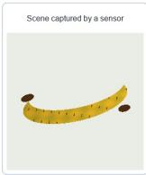

<details>
<summary>natural_image</summary>

Illustration of a yellow measuring tape captured by a sensor, with no text or symbols present.
</details>

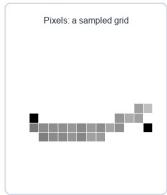

<details>
<summary>text_image</summary>

Pixels: a sampled grid
</details>

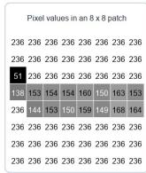

<details>
<summary>heatmap</summary>

Pixel values in an 8 x 8 patch
| | 236 | 236 | 236 | 236 | 236 | 236 | 236 |
|---|---|---|---|---|---|---|---|
| Row 1 | 51 | 236 | 236 | 236 | 236 | 236 | 236 |
| Row 2 | 138 | 153 | 154 | 154 | 160 | 150 | 163 |
| Row 3 | 236 | 144 | 153 | 150 | 159 | 149 | 168 |
| Row 4 | 236 | 236 | 236 | 236 | 236 | 236 | 236 |
| Row 5 | 236 | 236 | 236 | 236 | 236 | 236 | 236 |
| Row 6 | 236 | 236 | 236 | 236 | 236 | 236 | 236 |
The image contains a grid of cells with the same label 'Pixel values in an 8 x 8 patch' at the top. The cell values are explicitly labeled as '236'.
</details>

Pixel Matrix

## Python 实现

\# 读取图像并把它理解为矩阵

```python
import cv2, numpy as np
img = cv2.imread("images/part1-original.jpg")
rgb = cv2.cvtColor(img, cv2.COLOR_BGR2RGB)
gray = cv2.cvtColor(rgb, cv2.COLOR_RGB2GRAY)
patch = gray[96:104, 44:52]
print("RGB shape:", rgb.shape)
print("Gray shape:", gray.shape)
print("8x8 patch:")
print(patch)
```

## 代码演示：采样与量化


<details>
<summary>natural_image</summary>

Curved gray object with black circular markers at both ends (no text or symbols)
</details>

Original Gray Image

Sampling changes spatial detail; quantization changes gray-level detail  
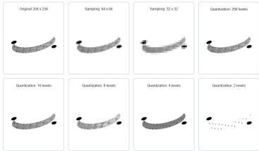

<details>
<summary>text_image</summary>

Original 264 x 256
Sampling 84.64
Sampling 32 x 32
Quantization 256 levels
Quantization 16 levels
Quantization 8 levels
Quantization 4 levels
Quantization 2 levels
</details>

Sampling / Quantization

## Python 实现

\# 采样改变空间分辨率，量化改变灰度级数

```python
import cv2, numpy as np, matplotlib.pyplot as plt
gray = cv2.imread("images/part1-gray.jpg", 0)
low = cv2.resize(gray, (32, 32), interpolation=cv2.INTER_AREA)
low_show = cv2.resize(low, gray.shape[::-1], interpolation=cv2.INTER_NEAREST)
q4 = np.round(gray / 255 * 3) / 3
q4 = (q4 * 255).astype("uint8")
imgs = [gray, low_show, q4]
titles = ["Original", "Sampling 32x32", "Quantization 4 levels"]
fig, ax = plt.subplots(1, 3, figsize=(12, 4))
for a, i, t in zip(ax, imgs, titles):
    a.imshow(i, cmap="gray"); a.set_title(t); a.axis("off")
plt.tight_layout(); plt.show()
```

## Banana Through Every Scan


<details>
<summary>natural_image</summary>

Single ripe yellow banana against a plain white background (no text or symbols)
</details>

Photo


<details>
<summary>natural_image</summary>

3D rendered illustration of a banana-shaped object with smooth shading (no text or symbols)
</details>

X-RAY

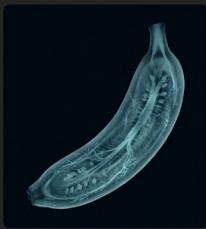

<details>
<summary>natural_image</summary>

Cross-sectional illustration of a banana-shaped object with internal structure (no text or symbols)
</details>

MRI


<details>
<summary>natural_image</summary>

Illustration of a banana with visible stem and leaf (no text or symbols)
</details>

CT

## 树的 CT

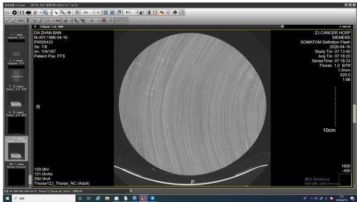

<details>
<summary>text_image</summary>

DA-ZHAN BAN
M.42Y 1995-04-16
R2025-53
Se: T8
Sr: 104-87
Patient Pos: FFS
ZJ CANCER HOSP
SIEMENS
SOMATOM Detection Rack
2026-04-16
Study 1m: 07-13-20
Acq 1m: 07-19-20
Series Time: 07-18-33
Thorax 10/00/00
1.0mm
525.0
1.66
10cm
120.0mA
121.0mA
252.0mA
Thorax X2, Thorax NC (Adult)
1600
450
2025 Windows
持续显示: 100% window
</details>

## 同一个物体，为什么会有不同的图像？

## 观察现象

同一个香蕉，在普通照片、X 光、MRI、CT 中呈现出完全不同的样子。

## 普通照片

- 主要记录物体表面的颜色和亮度  
- 依赖可见光反射  
- 更接近人眼看到的结果

## MRI 图像

- 反映组织中氢原子信号差异  
- 对软组织成像效果较好  
- 医学诊断中非常重要

## X 光图像

- 反映射线穿透后的衰减差异  
- 常用于观察内部结构  
- 骨骼、金属等高密度区域更明显

## CT 图像

- 从多个角度采集 X 光投影  
- 通过重建算法得到断层图像  
- 可以观察物体或人体内部切片

## 关键理解

图像不是“客观世界本身”，而是某种成像机制下得到的信息表达。

## 以 CT 为例：图像可以是 “计算” 出来的

## 直观理解

普通照片通常是一次成像，而 CT 图像不是简单 “拍” 出来的，而是通过多个角度的测量数据重建出来的。

多角度投影数据 → 重建算法 → 断层图像

## CT 采集什么？

- X 光从不同角度穿过物体  
- 探测器记录射线衰减程度  
- 得到一组投影数据

## CT 重建什么？

- 反推出物体内部结构  
- 得到二维切片图像  
- 多张切片可组成三维体数据

## 关键点

有些图像不是直接拍摄得到的，而是由观测数据经过数学模型和算法重建得到的。

## 代码演示：CT 投影与重建

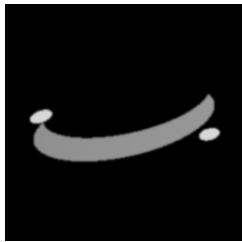

<details>
<summary>natural_image</summary>

Abstract curved line on black background (no text or symbols)
</details>

Object Structure x

CT: measurement data -> reconstruction algorithm -> slice image  
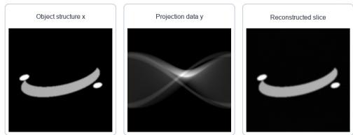

<details>
<summary>text_image</summary>

Object structure x
Projection data y
Reconstructed slice
</details>

Projection Data and CT Reconstruction

## Python 实现

```python
# CT: 多角度投影数据 -> 重建算法 -> 断层图像
import cv2, numpy as np, matplotlib.pyplot as plt
from skimage.transform import radon, iradon
x = cv2.imread("images/part1-density.jpg", 0) / 255.0
theta = np.linspace(0, 180, 180, endpoint=False)
y = radon(x, theta=theta, circle=False)
recon = iradon(y, theta=theta, circle=False, filter_name="ramp")
fig, ax = plt.subplots(1, 3, figsize=(12, 4))
for a, i, t in , zip(ax, [x, y, recom], ["x", "projection y", "reconstruction {

    a.imshow(c, cmap="gray"); a.set_title(t); a.axis("off")
plt.tight_layout(); plt.show()
```

## 从 “成像” 到 “模型”：图像工程中的基本抽象

## 为什么要建立数学模型？

真实成像过程往往很复杂。为了让计算机能够处理图像，我们需要把成像过程抽象成可以计算、分析和优化的数学模型。

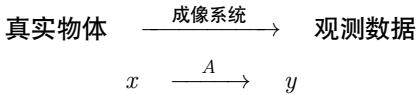

<details>
<summary>flowchart</summary>

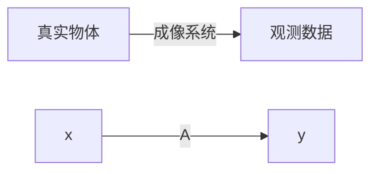
</details>

## 未知对象

- $x$ : 真实图像或物体结构  
- 可能是二维图像  
- 也可能是三维体数据

## 观测结果

- $y$ ：设备采集到的数据  
- 可能是照片  
- 也可能是投影、回波或传感器信号

## 关键理解

图像工程不是只处理“已经存在的图像”，也研究图像是怎样被测量、形成和恢复出来的。

## 一个统一的成像模型

## 常见抽象

很多成像过程都可以写成：

$$
y = A x + n
$$

- $x$ ：真实图像或物体结构；  
A: 成像系统或测量过程;  
- $y$ ：设备实际采集到的数据；  
- $n$ ：噪声、误差或干扰。

## 不同任务中的 $A$

- 普通拍照：相机成像过程；  
- 图像模糊：模糊核或运动轨迹；  
- CT 成像：多角度投影过程；  
- 图像压缩：信息编码与丢失过程。

## 一句话

看似不同的图像问题，背后常常有相似的数学结构。

## 代码演示：统一模型 $y = Ax + n$


<details>
<summary>natural_image</summary>

Curved gray object with black circular endpoints, no visible text or symbols
</details>

True Image x

Unified imaging model: $y = A x + n$  
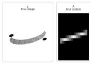

<details>
<summary>text_image</summary>

X
true image
A
blue system
</details>

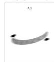

<details>
<summary>natural_image</summary>

Two curved, elongated objects with black dots above them, labeled 'A x' in the top-left corner (no other text or symbols)
</details>

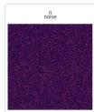

<details>
<summary>text_image</summary>

n
noise
</details>

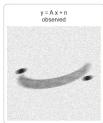

<details>
<summary>text_image</summary>

y = A x + n
observed
</details>

Observed Data y

## Python 实现

```python
# 用运动模糊模拟 A，用随机流动模拟 n
import cv2, numpy as np, matplotlib.pyplot as plt
x = cv2.imread("images/part1-gray.jpg", 0) / 255.0
k = np.zeros((17, 17)); k[8, :] = 1; k = k / k.sum()
Ax = cv2.filter2d(x.astype("float32"), -1, k)
n = np.random.normal(0, 0.05, x.shape)
y = np.clip(Ax + n, 0, 1)
imga = [x, k, Ax, y]
titles = ["x", "A": "cur kernel", "Ax", "y=Ax+n"]
fig, ax = plt.subplots(1, 4, figsize=(14, 4))
for a, i, t in zip(ax, imga, titles);
a.imshow(i, cmap='gray'); a.set_title(t); a.axis("off")
plt.tightLayout(); plt.show()
```

## 正问题与逆问题

## 正问题

已知真实图像 $x$ 和成像系统 $A$ ，求观测数据 $y: x \longrightarrow y, \quad y = Ax + n$

## 逆问题

已知观测数据 y 和成像系统 A，反过来恢复真实图像 $x: y \longrightarrow x$

## 正问题

- 模拟成像过程  
- 通常比较直接  
例如：清晰图像变成模糊图像

## 逆问题

- 从观测结果反推原因  
- 通常更加困难  
例如：模糊图像恢复清晰图像

## 一个简单例子：图像去噪

## 问题

观测图像 y 是真实图像 x 加上噪声得到的： $y = x + n$

## 恢复模型

$$
\min _ {x} \underbrace {\| x - y \| ^ {2}} _ {不要偏离原图太多} + \lambda \underbrace {R (x)} _ {让图像更平滑或更有结构}
$$

## 只相信数据

- 直接取 $x = y$  
- 噪声也被保留下来

## 正则过强

- 噪声减少  
- 细节和边缘也可能被抹掉

## 一个简单例子：图像去模糊

## 问题

拍照时手抖、物体运动或镜头失焦，都可能导致图像模糊。

$$
y = k * x + n
$$

- $x$ ：清晰图像；  
- $k$ ：模糊核；  
- \*：卷积操作；  
- $y$ ：观测到的模糊图像；  
- $n$ ：噪声或误差。

## 恢复目标

$$
\min _ {x} \| k * x - y \| ^ {2} + \lambda R (x)
$$

## 为什么难？

模糊会损失边缘和纹理等高频细节，而噪声又会干扰恢复过程。

## 代码演示：图像去噪

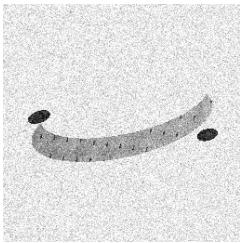

<details>
<summary>natural_image</summary>

Simple curved line drawing with two black dots at endpoints (no text or symbols)
</details>

Noisy Observation y

min ||A x - y||^2 + lambda R(x): data fidelity vs prior  


<details>
<summary>text_image</summary>

Clean image x
Data only
MSE=0.005
Week prior
small smoothing
MSE=0.0022
Balanced prior
MSE=0.0014
Over-strong prior
tool edges
MSE=0.050
</details>

Different Prior Strength

## Python 实现

\# 去噪：既要贴近观测 y，又要让图像更平滑

import cv2, numpy as np, matplotlib.pyplot as plt

y = cv2.imread("images/part1-noisy.jpg", 0) / 255.0

weak = cv2.GaussianBlur(y, (0, 0), 0.7)

balanced = cv2.GaussianBlur(y, (0, 0), 1.4)

strong = cv2.GaussianBlur(y, (0, 0), 3.2)

imgs = [y, weak, balanced, strong]

titles = ["Data only", "Weak prior", "Balanced prior", "Strong prior"]

fig, ax = plt.subplots(1, 4, figsize=(14, 4))

for a, i, t in zip(ax, imgs, titles):

a.imshow(i, cmap="gray"); a.set\_title(t); a.axis("off")

plt.tight\_layout(); plt.show()

## 去噪与去模糊有什么不同？

## 图像去噪

$$
y = x + n
$$

- 主要问题是随机扰动  
- 图像结构大体还在  
- 目标是去除噪声、保留细节

## 图像去模糊

$$
y = k * x + n
$$

- 细节被扩散或混合  
- 边缘变宽，纹理变弱  
- 目标是恢复丢失的高频信息

## 关键区别

去噪更多是“去掉多出来的干扰”，去模糊更多是“找回被混合掉的细节”。

## 一个简单例子：图像超分辨率

## 问题

低分辨率图像缺少细节，希望恢复出更高分辨率的图像。

$$
y = D x + n
$$

- $x$ ：高分辨率图像；  
- $D$ : 下采样过程;  
- $y$ ：低分辨率图像；  
- $n$ ：噪声或误差。

## 恢复目标

$$
\min _ {x} \| D x - y \| ^ {2} + \lambda R (x)
$$

## 课堂提问

电影里“把模糊监控无限放大后看清车牌”的情节，为什么现实中并不总是可行？

## 图像恢复中的共同结构

## 看似不同的问题

去噪、去模糊、超分辨率、CT重建，看起来任务不同。

去噪 : $y = x + n$

去模糊 : $y = k * x + n$

超分辨率： $y = Dx + n$

CT 重建 : $y = Ax + n$

## 共同形式

$$
\min _ {x} \| A x - y \| ^ {2} + \lambda R (x)
$$

## 课程观点

图像工程中很多问题不是孤立的，而是可以放在统一的建模框架下理解。

## 代码演示：三个逆问题对比

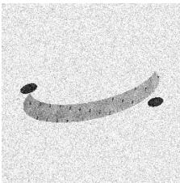

<details>
<summary>natural_image</summary>

Simple curved line drawing with two black dots at endpoints (no text or symbols)
</details>

Low-quality Observation

Inverse problems: recover x from y  


<details>
<summary>text_image</summary>

Target x
Observatory y
Functionalizations
Error observations
Decoding the target x (with error bars)
Target x
Observatory y
Functionalizations
Error observations
Decoding the target x (with error bars)
Target x
Observatory y
Functionalizations
Error observations
</details>

Denoising / Deblurring / Super-resolution

## Python 实现

# 逆问题：从观测 y 估计真实图像 x  
# 去噪：y = x + n  
# 去模糊：y = k \* x + n  
# 超分辨率：y = D x + n  
# 核心思想：  
# min ||A x - y||^2 + lambda R(x)  
print("Denoising removes added noise.")  
print("Deblurring recovers mixed details.")  
print("Super-resolution infers missing details.")

## 图像先验：什么样的图像更合理？

## 先验的含义

先验就是我们对“自然图像通常具有哪些规律”的经验判断。

## 传统图像先验

- 图像通常局部平滑  
- 边缘处允许明显变化  
- 梯度往往具有稀疏性  
- 相似纹理可能重复出现

## 领域图像先验

- 医学图像有解剖结构规律  
- 遥感图像有地物分布规律  
- 人脸图像有五官结构规律  
- 工业图像有规则纹理和缺陷模式

## 一句话

没有先验，很多逆问题无法稳定求解；先验越合适，恢复结果越可靠。

## 传统方法：人工设计先验

## 基本思路

传统图像恢复方法通常把先验写成一个显式的正则项：

$$
\min _ {x} \| A x - y \| ^ {2} + \lambda R (x)
$$

## 常见正则项

\- 平滑正则

$$
R (x) = \| \nabla x \| ^ {2}
$$

\- 全变差正则

$$
R (x) = \| \nabla x \| _ {1}
$$

## 特点

- 模型清楚  
- 可解释性较强  
- 便于数学分析  
- 但表达能力有限

## 深度学习方法：从数据中学习先验

## 基本思路

深度学习方法不一定显式写出 $R(x)$ ，而是从大量样本中学习图像规律。

$$
x \approx f _ {\theta} (y)
$$

- $y$ ：低质量图像，如带噪、模糊、低分辨率图像；  
- $x$ ：目标图像，如清晰、干净、高分辨率图像；  
- $f_{\theta}$ ：由神经网络表示的恢复模型；  
- $\theta$ ：通过训练数据学习得到的参数。

## 理解方式

神经网络可以看作从数据中学习了一个复杂的图像先验或恢复规则。

## 传统方法与深度学习方法的对比

## 传统模型驱动方法

- 显式写出成像模型  
- 显式设计正则项  
- 可解释性较好  
- 对数据依赖较少  
- 复杂场景下能力有限

## 深度学习数据驱动方法

- 从数据中学习映射  
- 表达能力强  
- 效果常常更好  
- 依赖数据和算力  
- 泛化性和可解释性仍是挑战

## 发展趋势

现代图像工程越来越强调模型驱动与数据驱动的结合。

## 模型驱动与数据驱动的结合

## 一种现代思路

不是完全抛弃传统模型，而是把成像模型、优化算法和神经网络结合起来。

物理成像模型 + 优化思想 + 深度网络 $\Longrightarrow$ 现代图像恢复方法

- 用 $A$ 描述真实成像过程；  
- 用数据保真项保证结果不偏离观测；  
- 用神经网络学习复杂先验；  
- 用迭代结构增强可解释性和稳定性。

## 课程主线

传统图像处理提供模型和思想，深度学习提供更强的表达能力。

## 从图像形成到图像处理

## 到目前为止，我们已经回答了第一个问题

## 图像从哪里来？

- 图像来自不同的成像机制；  
- 数字图像来自采样和量化；  
- 很多成像过程可以写成 $y = Ax + n$ ;  
- 从观测恢复图像往往是逆问题；  
- 逆问题需要结合数据保真和图像先验。

## 下一讲

现实中的图像经常存在噪声、模糊、低对比度、光照不均等问题。

如何让图像变得更清楚、更适合后续分析？

这就进入第二部分：图像增强与滤波。

## 第二部分：图像增强与滤波

## 核心问题

现实图像往往存在噪声、模糊、低对比度、光照不均等问题。图像增强与滤波的目标，是让图像更适合观察、分析和后续算法处理。

低质量图像 $\longrightarrow$ 增强后的图像 $\longrightarrow$ 后续分析

- 让暗图变亮；  
- 让模糊边缘更清楚；  
- 去除噪声干扰；  
- 提高目标与背景的差异。

## 注意

图像增强不一定追求 “真实”，而是追求 “更有用”。

## 什么是图像增强？

## 定义

图像增强是指通过一定的变换方法，改善图像的视觉效果或突出其中有用信息。

## 视觉层面

- 看得更清楚  
- 对比度更明显  
- 细节更容易观察  
- 暗部或亮部信息更突出

## 算法层面

- 便于边缘检测  
- 便于目标分割  
- 便于特征提取  
- 提高后续识别效果

## 一句话

图像增强是图像理解之前的重要预处理步骤。

## 图像增强的基本类型

## 常见方法

图像增强方法大致可以分为两类：点运算和邻域运算。

## 点运算

- 每个像素独立变化  
- 不考虑周围像素  
例如：亮度调整、对比度调整、灰度变换

$$
g (x, y) = T (f (x, y))
$$

## 邻域运算

- 当前像素由周围像素共同决定  
- 考虑局部结构  
例如：平滑滤波、锐化滤波、边缘增强

$$
g (x, y) = T (\Omega_ {x, y})
$$

## 灰度变换：最简单的图像增强

## 基本思想

对每个像素的灰度值进行函数变换：

$$
s = T (r)
$$

- $r$ : 原始灰度值;  
- $s$ : 变换后的灰度值;  
- $T$ : 灰度变换函数。

## 常见灰度变换

- 线性变换：调整亮度和对比度；  
- 对数变换：增强暗部细节；  
- Gamma 变换：模拟显示设备和视觉感知；  
- 反色变换：突出特殊结构。

## 线性灰度变换

## 基本形式

$$
s = a r + b
$$

- $a$ 控制对比度；  
- $b$ 控制整体亮度；  
- $a > 1$ ：增强对比度；  
- $0 < a < 1$ ：降低对比度；  
- $b > 0$ ：整体变亮；  
- $b < 0$ ：整体变暗。

## 工程理解

很多手机修图软件中的“亮度”和“对比度”调节，本质上就是灰度变换。

## 代码演示：线性变换

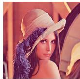

<details>
<summary>natural_image</summary>

Portrait of a woman wearing a wide-brimmed hat with feather decoration (no visible text or symbols)
</details>

Original

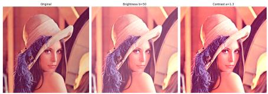

<details>
<summary>natural_image</summary>

Three portrait photos of a woman with purple hair and hat, labeled Original, Brightness in 50, and Contrast in 1.3 (no text or symbols on the images themselves)
</details>

Processed Result

## Python 实现

```python
# 对图像做亮度提升（s=a*r+b）和对比度增强（a=1.3，b=0）
import cv2, matplotlib.pyplot as plt, numpy as np
bgr = cv2.imread("lena_color_512.png");
rgb = cv2.cvtColor(bgr, cv2.COLOR_BGR2RGB)
bi = np.clip(rgb.astype(int) + 50, 0, 255).astype(np.uint8)
co = np.clip(rgb.astype(int) * 1.3, 0, 255).astype(np.uint8)
t = ["Original", "Brightness b=50", "Contrast a=1.3"]
f, ax = plt.subplots(1, 3, figsize=(16, 8))
for a, i, ti in zip(ax, [rgb, bi, co], t):
    a.imshow(i); a.set_title(ti); a.axis("off")
plt.tight_layout(); plt.show()
```

## 代码演示：非线性变换


<details>
<summary>natural_image</summary>

Portrait of a woman wearing a wide-brimmed hat with feather decoration (no visible text or symbols)
</details>

Original

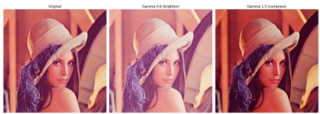

<details>
<summary>natural_image</summary>

Three portrait photos of a woman wearing a hat, labeled Original, Gamma 0.5 (brightest), and Gamma 3.5 (deeply) — all without any text or symbols on the images themselves.
</details>

Processed Result

## Python 实现

```python
# 非线性映射 s = c * r^gamma, gamma<1 提亮暗部，gamma>1 压缩暗部
import cv2, matplotlib.pyplot as plt, numpy as np
bgr = cv2.imread("lena_color_512.png"); rgb = cv2.cvtColor(bgr, cv2.COLOR_BGR2RGB)
g06 = np.clip((rgb/255)**0.6*255, 0, 255).astype("uint8")
g15 = np.clip((rgb/255)**1.5*255, 0, 255).astype("uint8")
t = ["Original", "Gamma 0.6 (brighten)", "Gamma 1.5 (compress)]
f, ax = plt.subplots(1, 3, figsize=(16, 8))
for a, i, ti in zip(ax, [rgb, g06, g15], t): a.imshow(i); a.set_title(ti); a.axis("off")
plt.tight_layout(); plt.show()
```

## 直方图：观察灰度分布

## 什么是直方图？

图像直方图统计每个灰度值在图像中出现的次数。

$$
h (k) = \# \{(x, y) \mid f (x, y) = k \}
$$

- 横轴：灰度值；  
- 纵轴：像素数量；  
- 暗图像：灰度集中在低值区域；  
- 亮图像：灰度集中在高值区域；  
- 低对比度图像：灰度分布范围较窄。

## 关键作用

直方图可以帮助我们判断图像是偏暗、偏亮，还是对比度不足。

## 直方图均衡化

## 基本思想

把原来集中在某些灰度范围内的像素，重新分布到更宽的灰度范围中，从而增强图像对比度。

$$
s = T (r)
$$

其中 T 由灰度累计分布函数决定。

## 效果

- 低对比度图像会变得更清晰；  
- 暗部和亮部细节可能更加明显；  
- 但也可能放大噪声；  
- 对某些图像可能产生过增强。

## 代码演示：直方图均衡化

## Python 实现

```python
# 绘制 RGB 三通道直方图 → 转换到 YCrCb 空间，仅对 Y（亮度）通道均衡化
import cv2, matplotlib.pyplot as plt, numpy as np
bgr = cv2.imread("lena_color_512.png"); rgb = cv2.cvtColor(bgr, cv2.COLOR_BGR2RGB)
for i, c in enumerate("rgb"):
    h = cv2.calcHist([rgb], [i], None, [256], [0, 256])
    plt.plot(h, color=c, label=f"c.upper()-channel", lw=1.5)
plt.xlim(0, 256); plt.legend(); plt.grid(alpha=.3); plt.show()
y = cv2.cvtColor(rgb, cv2.COLOR_RGB2YCrCb); y[:, :, 0]=cv2.equalizeHist(y[:, :, 0])
eq = cv2.cvtColor(y, cv2.COLOR_YCrCb2RGB)
f, ax = plt.subplots(2, 2, figsize=(14, 10))
for col, (im, ti) in enumerate(zip([rgb, eq], ["Original","Equalized"])):
    ax[0, col].imshow(im); ax[0, col].set_title(ti); ax[0, col].axis("off")
    gr = cv2.cvtColor(im, cv2.COLOR_RGB2GRAY)
    ax[1, col].hist(gr.ravel(), 256, [0, 256], color="gray"); ax[1, col].set_xlim(0, 256)
    ax[1, col].set_title(f"ti Histogram")
plt.tight_layout(); plt.show()
```

## 图像滤波：利用邻域信息

## 基本思想

滤波不是只改变一个像素本身，而是根据它周围一小片区域的信息来决定新的像素值。

$$
g (i, j) = \sum_ {m, n} w (m, n) f (i - m, j - n)
$$

- $f$ : 原始图像；  
- $g$ : 滤波后的图像;  
- $w$ ：滤波模板或卷积核；  
- 邻域大小决定考虑多少周围信息。

## 一句话

滤波的核心，是用局部邻域中的信息重新估计当前像素。

## 均值滤波：最简单的平滑方法

## 基本思想

用邻域内像素的平均值替代当前像素值。

$$
g (i, j) = \frac {1}{| \Omega |} \sum_ {(m, n) \in \Omega} f (i + m, j + n)
$$

## 优点

实现简单  
- 可以减弱随机噪声  
- 计算速度快

## 缺点

- 会模糊边缘  
- 细节容易被抹平  
- 对椒盐噪声效果一般

## 高斯滤波：更自然的平滑

## 基本思想

距离中心越近的像素权重越大，距离越远的像素权重越小。

$$
G (x, y) = \frac {1}{2 \pi \sigma^ {2}} \exp \left(- \frac {x ^ {2} + y ^ {2}}{2 \sigma^ {2}}\right)
$$

- $\sigma$ 控制平滑程度；  
- $\sigma$ 越大，图像越平滑；  
- 高斯滤波比均值滤波更加自然；  
- 常用于去噪和边缘检测前的预处理。

## 直观理解

高斯滤波相当于“中心像素附近的信息更可信，远处信息影响较小”。

## 中值滤波：对椒盐噪声特别有效

## 基本思想

用邻域中所有像素的中位数替代当前像素。

$$
g (i, j) = \operatorname{median} \left\{f (i + m, j + n): (m, n) \in \Omega \right\}
$$

## 适用场景

- 图像中出现黑白随机点；  
- 传输或传感器带来脉冲噪声；  
- 希望去噪同时尽量保留边缘。

## 关键区别

均值滤波容易被极端噪声值影响，而中值滤波对极端值更稳健。

## 代码演示：空间滤波

## Python 实现

```python
# 添加高斯噪声（var=25）→ 均值滤波（3×3）与高斯滤波（3×3）对比
# 添加椒盐噪声（0.05）→ 中值滤波（3×3），观察不同滤波器对噪声的抑制效果
import cv2, matplotlib.pyplot as plt, numpy as np
bgr_img = cv2.imread("lena_color_512.png")
g = cv2.cvtColor(bgr_img, cv2.COLOR_BGR2GRAY)
gs = np.clip(g.astype(int)+np.random.normal(0,5,g.shape).astype(int),0,255).astype("uint8")
sp = g.copy(); m=np.random.random(sp.shape); sp[m<.025]=0; sp[m>.975]=255
me = cv2.blur(gs,(3,3)); ga=cv2.GaussianBlur(gs,(3,3),1); md=cv2.medianBlur(sp,3)
f,ax = plt.subplots(2,4,figsize=(20,10))
for c,(im,t) in enumerate(zip([g,gs,me,ga],["Orig","+Gauss noise","Mean 3×3","Gauss 3×3"])):
    ax[0,c].imshow(im,"gray",vmin=0,vmax=255); ax[0,c].set_title(t); ax[0,c].axis("off")
for c,(im,t) in enumerate(zip([g,sp,md],["Orig","+S&P noise","Median 3×3"])):
    ax[1,c].imshow(im,"gray",vmin=0,vmax=255); ax[1,c].set_title(t); ax[1,c].axis("off")
ax[1,3].axis("off"); plt.tight_layout(); plt.show()
```

## 第二部分阶段小结

1 图像增强的目标是让图像更清楚、更有用。  
② 点运算只改变单个像素的灰度值。  
③ 灰度变换可以调节亮度和对比度。  
4 直方图可以描述图像的灰度分布。  
⑤ 直方图均衡化可以增强对比度。  
⑥ 滤波通过邻域信息改善图像质量。  
均值滤波、高斯滤波、中值滤波适合不同噪声场景。

## 下一步

平滑滤波可以去噪，但也可能模糊边缘。那么，如何突出边缘和细节？

接下来：锐化与边缘检测

## 第三部分：锐化与边缘检测

## 核心问题

平滑滤波可以减弱噪声，但也可能让边缘变得模糊。如果我们希望突出物体轮廓、纹理细节和结构变化，就需要进行锐化与边缘检测。

原始图像 → 锐化处理 → 边缘和细节更明显

## 锐化

- 增强图像细节  
- 使边缘更加清楚  
- 改善视觉清晰度

## 边缘检测

- 找出灰度变化明显的位置  
- 提取目标轮廓  
- 为分割、识别做准备

## 一句话

边缘通常对应图像中灰度变化剧烈的地方。

## 什么是边缘？

## 直观理解

在图像中，如果相邻区域的灰度或颜色发生明显变化，我们通常认为那里存在边缘。

- 物体与背景的交界处；  
- 明暗变化明显的位置；  
- 纹理方向发生变化的位置；  
- 不同材料、不同结构的边界。

## 数学理解

边缘可以看作图像函数变化最快的位置。

边缘 $\Longleftrightarrow$ 灰度变化大

## 一阶导数：用梯度描述边缘

## 基本思想

如果把图像看作二维函数 $f(x, y)$ ，那么灰度变化可以用偏导数描述：

$$
f _ {x} = \frac {\partial f}{\partial x}, \quad f _ {y} = \frac {\partial f}{\partial y}
$$

梯度向量为:

$$
\nabla f = (f _ {x}, f _ {y})
$$

梯度幅值为:

$$
| \nabla f | = \sqrt {f _ {x} ^ {2} + f _ {y} ^ {2}}
$$

- 梯度越大，说明灰度变化越剧烈；  
- 灰度变化剧烈的位置，往往就是边缘；  
- 边缘检测可以理解为寻找梯度较大的位置。

## 离散图像中的梯度近似

## 问题

数字图像不是连续函数，而是像素矩阵。因此，导数需要用差分来近似。

## 水平方向差分

$$
f _ {x} (i, j) \approx f (i, j + 1) - f (i, j)
$$

## 竖直方向差分

$$
f _ {y} (i, j) \approx f (i + 1, j) - f (i, j)
$$

## 理解

- 如果相邻像素差别很小，说明局部比较平滑；  
- 如果相邻像素差别很大，说明可能存在边缘；  
- 差分越大，边缘响应越强。

## Sobel 算子：常用的边缘检测方法

## 基本思想

Sobel 算子用两个卷积模板分别估计水平方向和竖直方向的灰度变化。

$$
G _ {x} = \left[ \begin{array}{c c c} - 1 & 0 & 1 \\ - 2 & 0 & 2 \\ - 1 & 0 & 1 \end{array} \right], \qquad G _ {y} = \left[ \begin{array}{c c c} - 1 & - 2 & - 1 \\ 0 & 0 & 0 \\ 1 & 2 & 1 \end{array} \right]
$$

$$
G = \sqrt {G _ {x} ^ {2} + G _ {y} ^ {2}}
$$

## 特点

- 能突出边缘位置；  
- 对噪声比简单差分更稳健；  
- 是最经典的边缘检测方法之一。

## 边缘检测例子


<details>
<summary>natural_image</summary>

Glass table with wine bottle and glass, no visible text or symbols on the main subjects
</details>

原图


<details>
<summary>natural_image</summary>

Line drawing of a wine bottle and glass on a table (no text or symbols)
</details>

边缘检测结果 (阈值 =0.5)

## 锐化：让细节更突出

## 基本思想

锐化的目标是增强图像中的高频成分，例如边缘、纹理和细节。

锐化图像 = 原图像 + 细节增强项

一种常见形式是：

$$
g = f + \alpha (f - f _ {\text { smooth }})
$$

其中：

- $f$ : 原始图像;  
- $f_{\mathrm{smooth}}$ ：平滑后的图像；  
- $f - f_{\mathrm{smooth}}$ ：图像中的细节部分；  
- $\alpha$ ：锐化强度。

## 直观理解

先找出图像中“被平滑掉的细节”，再把这些细节加回去。

## 拉普拉斯算子：二阶导数锐化

## 基本思想

拉普拉斯算子利用二阶导数检测灰度变化，常用于图像锐化。

$$
\Delta f = \frac {\partial^ {2} f}{\partial x ^ {2}} + \frac {\partial^ {2} f}{\partial y ^ {2}}
$$

常见离散模板：

$$
\left[ \begin{array}{c c c} {0} & {- 1} & {0} \\ {- 1} & {4} & {- 1} \\ {0} & {- 1} & {0} \end{array} \right] \quad \text {或} \quad \left[ \begin{array}{c c c} {- 1} & {- 1} & {- 1} \\ {- 1} & {8} & {- 1} \\ {- 1} & {- 1} & {- 1} \end{array} \right]
$$

锐化形式

$$
g = f + \lambda \Delta f
$$

注意

锐化可以增强边缘，但也可能同时放大噪声。

## 锐化例子


<details>
<summary>natural_image</summary>

Glass table with wine bottle and glass, reflecting dark liquid (no visible text or symbols)
</details>

原图


<details>
<summary>natural_image</summary>

A wine bottle and glass on a reflective table with a white sofa in the background (no visible text or symbols)
</details>

$$
\left[ \begin{array}{c c c} 0 & - 1 & 0 \\ - 1 & 4 & - 1 \\ 0 & - 1 & 0 \end{array} \right]
$$


<details>
<summary>natural_image</summary>

Glass table with wine bottle and glass, reflecting on a reflective surface (no text or symbols visible)
</details>

$$
\left[ \begin{array}{c c c} - 1 & - 1 & - 1 \\ - 1 & 8 & - 1 \\ - 1 & - 1 & - 1 \end{array} \right]
$$

## 锐化与平滑的关系

## 看似相反，其实互补

## 平滑滤波

- 减弱噪声  
- 抑制高频成分  
- 图像更柔和  
- 可能模糊边缘

## 锐化处理

- 增强细节  
- 突出高频成分  
- 边缘更清楚  
- 可能放大噪声

## 工程经验

实际处理中，常常需要先适当去噪，再进行边缘检测或锐化。

去噪 → 锐化 → 边缘检测

## 边缘检测有什么用？

## 边缘是图像理解的重要线索

- 在医学图像中，帮助观察器官、病灶和组织边界；  
- 在遥感图像中，帮助提取道路、河流、建筑轮廓；  
- 在工业检测中，帮助发现裂纹、划痕和缺陷；  
- 在自动驾驶中，帮助识别车道线、车辆和行人轮廓；  
- 在文档图像中，帮助提取文字边界和版面结构。

## 一句话

边缘检测不是最终目的，而是许多图像分析任务的基础步骤。

## 第三部分阶段小结

① 边缘通常对应图像中灰度变化剧烈的位置。  
② 梯度可以描述图像的一阶变化。  
③ 梯度幅值越大，边缘响应通常越强。  
4 数字图像中的导数通常用差分近似。  
⑤ Sobel 算子是经典的一阶边缘检测方法。  
⑥ 锐化可以增强图像细节，但也可能放大噪声。  
7 平滑与锐化并不是完全对立，而是需要配合使用。

## 下一步

有了边缘之后，我们还希望进一步把图像中的目标区域分离出来。这就进入下一部分：图像分割。

## 第四部分：图像分割

## 核心问题

有了边缘之后，我们常常还希望进一步回答：

图像中哪些像素属于同一个目标？

图像分割的目标，是把图像划分成若干有意义的区域。

原始图像 → 区域划分 → 目标提取

## 典型任务

- 从医学图像中分割器官或病灶；  
- 从遥感图像中分割道路、建筑、水体；  
- 从自然图像中分割人物、车辆、动物；  
- 从工业图像中分割缺陷区域。

## 什么是图像分割？

## 基本定义

图像分割是将图像中的像素按照某种相似性或目标语义划分为不同区域的过程。

设图像区域为 $\Omega$ ，分割结果可以表示为：

$$
\Omega = \Omega_ {1} \cup \Omega_ {2} \cup \dots \cup \Omega_ {K}
$$

其中：

- $\Omega_{k}$ : 第 $k$ 个区域;  
- 同一区域内部像素具有相似性质；  
- 不同区域之间具有明显差异。

## 关键问题

## 分割依据：像素为什么属于同一区域？

## 常见依据

- 灰度相似：亮度接近；  
- 颜色相似：RGB 或 HSV 值接近；  
- 纹理相似：局部结构或重复模式相似；  
- 空间相邻：位置上连通；  
- 语义一致：都属于同一类目标。

## 例子

- 蓝色区域可能对应天空；  
- 灰色细长区域可能对应道路；  
- 医学图像中亮度异常区域可能对应病灶。

## 注意

## 阈值分割：最简单的分割方法

## 基本思想

如果目标和背景在灰度上差异明显，可以用一个阈值 T 将它们分开。

$$
g (x, y) = \left\{ \begin{array}{l l} 1, & f (x, y) \geq T, \\ 0, & f (x, y) <   T. \end{array} \right.
$$

## 理解

- 灰度大于阈值：判为目标；  
- 灰度小于阈值：判为背景；  
- 结果通常是一幅二值图像。

## 适用场景

目标与背景对比明显、光照较均匀的图像。

## 阈值怎么选？

## 手动阈值

根据经验或观察直方图选择一个阈值。

$$
T = 1 2 8
$$

## 自动阈值

让算法根据图像灰度分布自动寻找较合适的阈值。直方图视角

如果目标和背景灰度分布明显分成两堆，阈值可以放在两堆之间。

背景峰 | 目标峰

## 课堂提问

如果一张图像左边很暗、右边很亮，还能用同一个全局阈值吗？

## 区域生长：从一个点扩展成一个区域

## 基本思想

先选择一个种子点，然后把周围与它相似的像素逐步加入同一区域。

种子点 → 检查邻域 → 加入相似像素 → 形成区域

## 判断依据

- 灰度差是否小于阈值；  
- 颜色是否接近；  
- 是否与当前区域连通。

## 特点

结果直观，但对种子点选择和相似性标准比较敏感。

## 边缘方法与区域方法的区别

## 边缘方法

- 关注灰度突变；  
- 先找边界；  
- 适合轮廓清楚的目标；  
- 边缘断裂时效果会受影响。

## 区域方法

- 关注区域内部一致性；  
- 先找相似像素集合；  
- 适合灰度或颜色较均匀的目标；  
- 对光照变化比较敏感。

## 理解

边缘方法问的是“边界在哪里”，区域方法问的是“哪些像素属于一起”。

## 传统分割方法的局限

## 为什么分割不容易？

真实图像往往比理想情况复杂得多：

- 光照不均：同一物体不同位置亮度不同；  
- 背景复杂：目标和背景颜色接近；  
- 边界模糊：物体轮廓不一定清楚；  
- 噪声干扰：局部像素可能出现异常；  
- 语义复杂：同一类目标外观差异很大。

## 关键理解

传统方法主要依赖灰度、颜色、边缘等低层特征，但很多时候，分割还需要理解图像中的“内容”。

## 从传统分割到语义分割

## 传统分割

把图像分成若干区域，但不一定知道每个区域是什么。

图像 $\longrightarrow$ 区域 1、区域 2、区域 3

## 语义分割

不仅要分出区域，还要判断每个像素属于哪一类。

图像 $\longrightarrow$ 道路、天空、行人、车辆、建筑

## 一句话

传统分割更关注 “哪里不同”，语义分割更关注 “这是什么”。

## 语义分割：给每个像素分类

## 基本思想

语义分割可以理解为像素级分类任务。

$$
f (x, y) \longrightarrow c (x, y)
$$

其中：

- $f(x, y)$ : 图像中位置 $(x, y)$ 的像素信息;  
- $c(x, y)$ : 该像素对应的类别标签;  
- 每个像素都要被赋予一个语义类别。

## 例子

- 天空像素标为 sky;  
- 道路像素标为 road;  
- 行人像素标为 person;  
- 车辆像素标为 car。

## 深度学习如何做分割？

## 基本思路

用神经网络从图像中学习特征，并输出每个像素的类别。

输入图像 $\xrightarrow{CNN / Transformer}$ 像素级类别图

## 网络需要学习什么？

- 局部纹理：边缘、角点、颜色变化；  
- 中层结构：轮廓、部件、局部形状；  
- 高层语义：人、车、道路、器官等目标类别；  
- 空间关系：哪些区域可能属于同一个对象。

## 理解

深度学习方法不只是看单个像素，而是结合上下文判断像素类别。

## 语义分割与实例分割

## 语义分割

只判断每个像素属于哪一类。

所有人 → person

## 实例分割

不仅判断类别，还要区分不同个体。

人 1, 人 2, 人 3

- 语义分割：关心“是什么”；  
- 实例分割：还关心“是哪一个”；  
- 医学、自动驾驶、机器人感知中都很重要。

## 分割结果如何评价？

## 问题

算法分割出来的区域，和人工标注的真实区域有多接近？

常用指标：IoU

$$
\mathrm{IoU} = \frac {\text {预测区域} \cap \text {真实区域}}{\text {预测区域} \cup \text {真实区域}}
$$

## 理解

- 交集越大，说明分割越准确；  
- 并集越大，说明总体覆盖范围越广；  
- IoU 越接近 1，分割结果越好。

## 图像分割的例子

图像分割·课堂互动演示  


<details>
<summary>text_image</summary>

阈值参数
区域发生
无源的影响
M/σI 精什么
工作时的缩放
阈值 T 128
阈值范围：0.0000
阈值范围：0.0000
阈值范围：0.0000
阈值范围：0.0000
阈值范围：0.0000
阈值范围：0.0000
阈值范围：0.0000
阈值范围：0.0000
阈值范围：0.0000
阈值范围：0.0000
</details>


  
图: 点击图片进入网页端交互演示

## 图像分割的应用

## 分割是图像理解的重要基础

- 医学诊断：分割肿瘤、血管、器官；  
- 自动驾驶：分割道路、车道线、车辆、行人；  
- 遥感分析：分割建筑、水体、农田、森林；  
- 工业检测：分割裂纹、污点、缺陷区域；  
- 智能修图：人像抠图、背景替换、主体增强。

## 一句话

分割把图像从“像素矩阵”变成了“有意义的区域”。

## 第四部分阶段小结

① 图像分割的目标是把图像划分成有意义的区域。  
② 阈值分割适合目标与背景差异明显的场景。  
③ 区域生长从种子点出发，逐步合并相似像素。  
4 边缘方法关注“边界在哪里”。  
⑤ 区域方法关注 “哪些像素属于一起”。  
⑥ 语义分割进一步要求判断每个像素的类别。  
⑦ 深度学习方法可以结合局部特征与上下文语义。

## 下一步

分割可以得到目标区域，但我们还希望进一步描述图像内容。接下来：图像特征与目标识别。

## 第五部分：图像特征与目标识别

## 核心问题

经过增强、边缘检测和分割之后，我们希望进一步回答：

图像中有什么？它属于哪一类？目标在哪里？

图像 → 特征表示 → 识别结果

## 图像特征

- 颜色：图像有哪些颜色  
- 纹理：局部结构是否重复  
- 形状：目标轮廓和几何性质  
- 深度特征：由神经网络自动学习

## 目标识别

- 图像分类：整张图是什么  
- 目标检测：目标在哪里、是什么  
- 图像分割：每个像素属于什么  
- 应用：医学、遥感、自动驾驶、工业检测

## 为什么不能直接比较像素？

## 朴素想法

图像本来就是像素矩阵，是否可以直接比较两个图像的像素？

$$
I = \left[ \begin{array}{c c c} I (1, 1) & I (1, 2) & \dots \\ I (2, 1) & I (2, 2) & \dots \\ \vdots & \vdots & \ddots \end{array} \right]
$$

## 像素很敏感

- 目标平移，像素位置改变  
- 光照变化，灰度值改变  
- 尺度变化，目标大小改变  
- 背景复杂，干扰像素很多

## 特征更稳定

- 保留有用信息  
- 抑制无关变化  
- 方便分类器判断  
- 支持相似图像匹配

## 关键理解

## 颜色特征：最直观的图像描述

## 基本思想

颜色特征描述图像中颜色的组成和分布。最常见的方法是颜色直方图：

$$
h (k) = \# \{(x, y) \mid I (x, y) = k \}
$$

## 优点

- 简单直观  
- 计算速度快  
- 对目标位置变化不太敏感  
- 适合颜色差异明显的目标

## 局限

- 不描述空间结构  
- 不同物体可能颜色相似  
- 容易受光照影响  
- 不能区分形状差异

## 例子

只看颜色时，绿色苹果和绿色葡萄可能很难区分。

## 纹理与形状特征

## 纹理特征

纹理描述局部灰度或颜色的重复变化模式。

- 粗糙或平滑  
- 是否有周期性  
- 是否有方向性  
- 局部结构是否规则

## 形状特征

形状描述目标区域的几何外观。

- 面积、周长  
- 长宽比  
- 圆形度  
- 边界轮廓

## 应用理解

- 纹理：木纹、布料、草地、医学组织结构；  
- 形状：零件检测、字符识别、病灶轮廓分析。

## 注意

形状特征通常依赖前一步分割结果；分割不准，形状描述也会不可靠。

## 局部特征：图像中的关键位置

## 基本思想

有些位置比普通像素更有辨识度，例如角点、斑点、边缘交汇处和纹理突变处。

## 局部特征关注

- 哪些位置比较稳定  
这些位置周围长什么样  
- 不同图像中能否找到对应关系

## 典型应用

- 图像匹配  
全景拼接  
- 目标跟踪  
- 三维重建  
- 视觉定位

## 一句话

局部特征像图像中的“指纹点”，可以帮助计算机建立图像之间的对应关系。

## 从人工特征到深度特征

## 传统识别流程

图像 → 人工特征 → 分类器 → 类别

## 深度学习识别流程

图像 → 神经网络 → 类别

## 人工特征

- 可解释性较强  
- 设计依赖经验  
- 复杂场景表达能力有限

## 深度特征

- 从数据中自动学习  
- 表达能力强  
- 依赖数据、算力和训练方法

## 卷积神经网络：自动学习图像特征

## 基本思想

卷积神经网络 CNN 可以从大量图像中自动学习多层次特征。

像素 → 边缘 → 纹理 → 部件 → 目标

## 低层特征

- 边缘  
- 角点  
- 颜色变化

## 中层特征

- 局部纹理  
- 轮廓结构  
- 目标部件

## 高层特征

- 人脸  
- 车辆  
- 器官  
- 场景语义

## 卷积操作：从滤波到 CNN

## 卷积形式

卷积核在图像上滑动，检测局部区域中是否存在某种模式。

$$
g (i, j) = \sum_ {m, n} w (m, n) f (i - m, j - n)
$$

## 前面讲过的卷积

- 均值滤波：卷积核用于平滑  
- Sobel 算子：卷积核用于边缘检测  
- 拉普拉斯算子：卷积核用于锐化

## CNN 中的卷积

- 卷积核不是人工指定  
- 通过训练数据自动学习  
- 不同层学习不同层次的模式

## 重要联系

CNN 中的卷积，与滤波、锐化、边缘检测在数学形式上是相通的。

## 图像分类、目标检测与图像分割

## 图像分类

图像 $\rightarrow$ 类别

- 回答：整张图是什么  
- 输出：一个类别  
- 例：猫、狗、汽车

## 目标检测

图像 $\rightarrow$ 框 $+$ 类别

- 回答：目标在哪里、是什么  
- 输出：边界框和类别  
- 例：行人检测

## 图像分割

图像 $\rightarrow$ 像素类别

- 回答：每个像素是什么  
- 输出：像素级 mask  
- 例：道路分割

## 一句话

分类回答 “是什么”，检测回答 “在哪里、是什么”，分割回答 “每个像素是什么”。

## 代码演示：图像分米

## 任务

用CIFAR-10图像训练一个简单CNN，输出整张图的类别。

## Python 实现

import torch, torch.nn as nn, torch.nn.functional as F  
```python
class TinyCifarCNN(nn.Module):
    def __init__(self):
    super().__init__()
    self.conv1 = nn.Conv2d(3, 32, 3, padding=1)
    self.conv2 = nn.Conv2d(32, 64, 3, padding=1)
    self.fc = nn.Linear(64 * 8 * 8, 10)

    def forward(self, x):
    x = F.max_pool2d(F.relu(self.conv1(x)), 2)
    x = F.max_pool2d(F.relu(self.conv2(x)), 2)
    x = x.flatten(1)
    return self.fc(x)
```

\# 输出 logits，经过 softmax 后得到每个类别的概率

## 输出形式

一张图像 $\longrightarrow$ $[p_{1}, p_{2}, \ldots, p_{10}]$

选择概率最大的类别作为预测结果。

## 代码演示·目标检测

## 任务

输入一张图像，输出目标类别和边界框。

$$
\text { 图像 } \rightarrow (\mathrm{class}, x _ {1}, y _ {1}, x _ {2}, y _ {2})
$$

## Python 实现

```python
class TinyDetector(nn.Module):
    def __init__(self):
    super().__init__()
    self.features = nn.Sequential(
    nn.Conv2d(3,16,3,padding=1), nn.ReLU(), nn.MaxPool2d(2),
    nn.Conv2d(16,32,3,padding=1), nn.ReLU(), nn.MaxPool2d(2))
    self.shared = nn.Sequential(nn.Flatten(),
    nn.Linear(32*16*16,128), nn.ReLU())
    self.cls_head = nn.Linear(128, 2) # 类别
    self.box_head = nn.Linear(128, 4) # 边界框

def forward(self, x):
    h = self.shared(self.features(x))
    return self.cls_head(h), torch.sigmoid(self.box_head(h))
```

\# 损失 = 分类损失 + 位置框回归损失

## 代和演示·图像分割

## 任务

输入一张图像，输出一张与原图大小对应的 mask。

图像 $\rightarrow$ 像素级类别图

## Python 实现

```python
class TinySegNet(nn.Module):
    def __init__(self):
    super().__init__()
    self.enc1 = nn.Conv2d(3, 16, 3, padding=1)
    self.enc2 = nn.Conv2d(16, 32, 3, padding=1)
    self.dec1 = nn.Conv2d(32, 16, 3, padding=1)
    self.out = nn.Conv2d(16, 1, 1)

def forward(self, x):
    x = F.relu(self.enc1(x))
    x = F.max_pool2d(x, 2)
    x = F.relu(self.enc2(x))
    x = F.interpolate(x, scale_factor=2)
    x = F.relu(self.dec1(x))
    return self.out(x)
```

\# 每个像素输出一个值，sigmoid 后表示属于目标的概率

## Foundation Model: 用 CLIP 提取特征

## 基本思想

CLIP 这类大模型已经在大规模图文数据上学习了通用视觉特征。

图像 → CLIP 图像编码器 → 特征向量 → 线性分类器

## 普通 CNN

- 从当前数据集开始训练  
- 小数据时容易过拟合  
- 训练成本相对更高

## CLIP 特征

- 复用大模型已有特征  
- 只训练简单分类头  
- 小样本任务中常常更稳定

## 理解

Foundation model 可以看作一个通用特征提取器，把 “学特征” 的成本提前完成。

## 识别结果如何评价？

## 分类任务常用指标

- Accuracy: 整体预测正确的比例;  
- Precision：预测为某类的样本中，有多少是真的；  
- Recall：真实属于某类的样本中，有多少被找回；  
- F1: 综合考虑 Precision 和 Recall。

$$
\text { Accuracy } = \frac {\text { 预测正确的样本数 }}{\text { 总样本数 }}
$$

## 检测和分割常用指标：IoU

$$
\mathrm{IoU} = \frac {\text {预测区域} \cap \text {真实区域}}{\text {预测区域} \cup \text {真实区域}}
$$

## 注意

评价指标要结合任务目标选择，不能只看一个数字。

## 图像特征与目标识别的应用

## 医学图像

- 判断正常/异常  
- 辅助定位病灶  
- 分析病理切片  
- 要重视可靠性与临床验证

## 工业检测

- 缺陷识别  
- 零件分类  
- 表面划痕检测

## 遥感图像

- 建筑、道路、水体识别  
- 船只、车辆等小目标检测  
- 地物分类和变化检测

## 自动驾驶

- 车辆、行人、交通标志检测  
- 道路和车道线分割  
- 场景理解与决策辅助

## 第五部分阶段小结

1 图像特征是对图像有用信息的数值化描述。  
② 颜色、纹理、形状和局部结构都是常见人工特征。  
③ 直接比较像素往往不稳定，需要更稳健的特征表示。  
4 传统方法通常先人工设计特征，再使用分类器识别。  
5 深度学习方法可以从数据中自动学习多层次特征。  
6 图像分类、目标检测和图像分割回答的问题不同。  
7 Foundation model 可以作为通用特征提取器，降低小样本任务成本。

## 本部分核心

从 “图像是什么样子” 到 “图像里有什么”，关键在于建立有效的图像表示。

## 结束语

## 图像工程研究什么？

它研究的不只是“怎样处理一张图片”，而是：

- 图像如何形成；  
- 图像如何被表示；  
- 图像如何被增强和恢复；  
- 图像中的结构如何被提取；  
- 图像中的目标如何被理解。

## 一句话总结

图像工程把现实世界中的视觉信息，转化为计算机可以处理、分析和理解的数字信息。

谢谢！